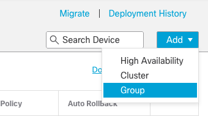
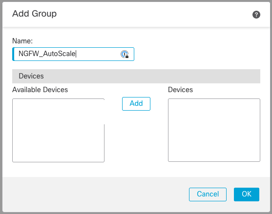

# Secure Firewall Autoscaling in AWS using Terraform


The following deployment uses Terraform to provision a dynamic number of Secure Firewalls into a Service VPC behind an 
AWS Gateway Load Balancer (GWLB) using AWS Auto Scaling. With Cisco Secure Firewall Threat Defense (FTD), we support the
AWS Gateway Load Balancer (GWLB) to drive simple, agile, and efficient security in the cloud. Further, utilizing 
Terraform and AWS Auto Scaling Groups, we can extend this deployment automation to handle scaling the number of Secure 
Firewall instances deployed in AWS based on load or other metric. These integrations simplify the insertion and 
expansion of Cisco Secure Firewall in AWS.

## Prerequisites

* AWS Account with correct access rights to regions, availability zones, VPCs, subnets, security groups, routing, and
  EC2 instances.
* Access to Cisco Firewall Management Center (FMC). You have two options:
    * Option 1: Deploy a virtual FMC into the AWS VPC. The instance size of the virtual FMC will C5.4XL.
    * Option 2: Use an existing Cloud-delivered Firewall Management Center (cdFMC) hosted in Cisco Defense
      Orchestrator (CDO). This option requires that you have a provisioned cdFMC that is licensed in CDO.
* AWS Marketplace: If you have never subscribed to the Cisco Secure Firewall Threat Defense Virtual (FTDv) or Firewall
  Management Center Virtual (FMCv), follow these links and subscribe to both these products in the AWS Marketplace:
    * [Cisco Secure Firewall Management Center Virtual - BYOL](https://aws.amazon.com/marketplace/pp/prodview-nokd5afymp54q)
    * [Cisco Secure Firewall Threat Defense Virtual - BYOL](https://aws.amazon.com/marketplace/pp/prodview-p2336sqyya34e)

  ## Architecture Overview

The following diagram shows a scalable architecture for protecting traffic with Cisco Secure Firewall and AWS Gateway
Load Balancer. When load (or other targeted metric) across the deployment increases beyond a target threshold, the AWS
Auto Scaling Group "Instances" value will increment to accommodate the increased load. When the load decreases below the
lower threshold, the value will decrement to tear down the extra Cisco Secure Firewall Threat Defense instance.


In the App VPC, we have 2 subnets (an App subnet, a GWLBe subnet) and an Internet Gateway:

* The App subnet: Where the application instance lives and routes all traffic to the GWLBe.
* The GWLBe subnet: Uses a private link to send traffic to the GWLB in the Service VPC.

In the Service VPC we have 2 subnets:

* The Data subnet: Used to hairpin data traffic through the Secure Firewall Group.
* The Mgmt subnet: Used to manage the FTDv's and where the FMCv lives, if we choose to deploy one. Also, the Mgmt subnet
  is assigned elastic IP addresses and an Internet Gateway for external management.

### Traffic flow through the virtual infrastructure:

* From the Application server the traffic outbound goes to the GWLB VPC endpoint (within the App VPC).
* Then the GWLB VPC endpoint passes traffic to the Load Balancer Target Group using the GENEVE protocol.
* This traffic is able to be load balanced across all FTDv instances within the AWS Application Auto Scaling Group
  because of GENEVE protocol encapsulation.
* Then the traffic is inspected by the FTDv instance

* After inspection, outbound traffic will hit the GWLBe and be passed to the GWLB subnet (flagged as external traffic)
  and on to the Internet Gateway.
* For inbound traffic, the Internet Gateway will hand traffic off to the GWLB subnet to the GWLB endpoint, filtered by
  the FTDv instance, back to the GWLB subnet (flagged as local traffic), and back to the App VPC subnet.

* Firewall rules are based on source and destination IP addresses and subnets rather than Zones or Interfaces.

## Firewall Management Center Options

For the Firewall Management Center, we have two options.

### Deploy an FMCv

You can deploy a FMCv into the AWS VPC. The FMCv is installed on a c5.4xlarge instance with one interface that is
connected to the Mgmt subnet and an Elastic IP assigned for public access.

> **Note**: When provisioning a FMCv in AWS it takes approximately 20–25 minutes for the FMC to be fully up and operational.

### Use a Cloud-delivered FMC

You can use a Cloud-delivered FMC hosted in Cisco Defense Orchestrator. The cdFMC is a SaaS instance of FMC and must be
licensed and provisioned in advance. In this design, the FTDv registers with the cdFMC in the cloud and there is no
second EC2 instance in the VPC.

> **Note:** This Lab does not provision a cdFMC. To use a cdFMC, you must license and provision it in CDO in advance.

### Making your selection

In this Lab, we walk you through each option so there is no confusion, but when you must decide for yourself, it's as
simple as answering a **true** or **false** question.

In the `terraform.tfvars` file we have a variable assignment for `create_fmcv`:

* `true`: Terraform provisions the FMCv into the VPC and register the FTDv to * `false`: Terraform registers the FTDv to
  your cdFMC.

The following code sample shows the variable.

```
# To deploy an FMCv in the mgmt subnet set "create_fmcv" to true. If using cdFMC in CDO set value to false.
# This value must be set!
create_fmcv = false
```

### Secure Firewall Manager Initial Configuration

This lab requires some initial configuration to the FMC or cdFMC in to properly deploy the autoscaling instances as
targets by the GWLB. Every new device that is instantiated within the AWS Application Auto Scaling Group after our first
deployment will adopt these settings automatically.

* Create a device group with a name that matches the default device group name that Terraform expects. The default value
  for the lab is: `NGFW_AutoScale`.
  
  

* Create two Security Zones on the FMC under `Objects > Object Management > Interface > Add Security Zone`
  
* Create one Inside and one Outside zone, both Routed, with no assigned interfaces. The interface assignment will be
  completed by API call as the Auto Scale instances deploy.
  
  

* Create a new FTD Platform Settings policy `Devices > Platform Settings > New Policy > Threat Defense Settings` to
  allow the Gateway Load Balancer Health Check process to successfully complete. This process uses SSH availability to
  determine the health of the FTDv instance.
  

* After creating the policy, go to SSH settings and allow the inside and outside zones to connect, then click `Okay` and
  finally `Save`
  
  

### Terraform Structure

Starting in the `/network` directory, where we build the AWS infrastructure such as VPC, subnets, GWLBs, and EC2
instances using AWS Terraform Provider.

The second directory is `/ngfw`, where we configure the AWS Auto Scaling Target Group, Lambda functions for FTDv device
registration, SNS and CloudWatch eventing to enable lifecycle management, a few additional AWS components to enable the
Auto Scaling to seamlessly function, and finally to create objects and access policies. We run Terraform in each
directory independently to give you the best learning experience.

# Setting up the Terraform Environment

In this section, we set up the Terraform structure for this project and add the necessary input variables to the `terraform.tfvars` file.

## Clone the GitHub Repository

First, get the code that you need for this Lab. From the terminal on the right, run the following command to clone the repository.

```bash
cd /home/developer/src
git clone https://github.com/CiscoDevNet/secure-firewall-automation.git
```

This command clones the `secure-firewall-automation` repo to the `/home/developer/src` directory.

```
developer:src > pwd
/home/developer/src
developer:src > git clone https://github.com/CiscoDevNet/secure-firewall-automation.git
Cloning into 'secure-firewall-automation'...
remote: Enumerating objects: 155, done.
remote: Counting objects: 100% (155/155), done.
remote: Compressing objects: 100% (108/108), done.
remote: Total 155 (delta 27), reused 142 (delta 22), pack-reused 0
Receiving objects: 100% (155/155), 46.33 KiB | 2.32 MiB/s, done.
Resolving deltas: 100% (27/27), done.
developer:src >
```

In the editor on the right, refresh the `/src` folder to see the `secure-firewall-automation` directory.


In this Lab, we provision and configure Secure Firewall Autoscaling in AWS using Terraform. So let's jump into that directory.

```bash
cd /home/developer/src/secure-firewall-automation/aws/autoscale
```

## Project Structure

In the `/aws/autoscale` directory, we see the 2 additional directories, `/network` and `/ngfw`. Each directory has their own Terraform files.


In the `autoscale` directory, there are two other directories, `network` and `ngfw`. Using the editor to the right, review the Lab files.

* The `network` directory holds all the resource files for the AWS infrastructure, such as VPC, subnets, gateways, load balancers, and ec2 instances.
* The `ngfw` directory holds the resource files for both the Firepower Management Center (FMC) and the Firepower Threat Defense (FTD) configuration, such as devices registration, access policies, objects, and access rules. We are going to run Terraform from each of these directories, which means the `network` and the `ngfw` resources are isolated from each other. We do this for simplicity to help you learn how each provider works.

### Terraform Providers

In each directory, there is a `provider.tf` file where we set the Terraform providers. For the `/network/provider.tf`, we only use the AWS provider. We only need the AWS provider because we are only provisioning AWS infrastructure resources.

```terraform
terraform {
  required_providers {
    aws = {
      source  = "hashicorp/aws"
      version = ">= 5.0"
    }
  }
}

provider "aws" {
    access_key = var.aws_access_key
    secret_key = var.aws_secret_key
    region     =  var.region
}
```

In the `/ngfw/provider.tf` file, you see that we are using the Cisco FMC and Hashicorp AWS providers. As stated in the overview, we have an option to use cdFMC in CDO or provision a Virtual FMC (FMCv) in our VPC.

```terraform
terraform {
  required_providers {
    aws = {
      source  = "hashicorp/aws"
      version = ">= 5.0"
    }
    fmc = {
      source = "CiscoDevNet/fmc"
      version = ">=1.2.4"
    }
  }
}

provider "aws" {
    access_key = var.aws_access_key
    secret_key = var.aws_secret_key
    region     =  var.region
}

provider "fmc" {
  fmc_username = local.fmc_user
  fmc_password = local.fmc_pass
  fmc_host = local.fmc_host
  fmc_insecure_skip_verify = var.fmc_insecure_skip_verify
  is_cdfmc  = local.is_cdfmc
  cdo_token = local.cdo_token
  cdfmc_domain_uuid = local.cdfmc_domain_uuid
}
```

Looking at both these provider files we see numerous variables being used as values. Most of the values in our resource files reference a variable or another resource. Since that is the case, we must declare and assign our variables.

### Declaring and Assigning Variables

To declare variables, we use `variable "var_name"` in the Terraform files. In this case, we dedicate a `variables.tf` file for all our variables. Once we declare the variable, we can use them to configure our resources.

But how do we actually assign a value to that variable? In the `/network/variables.tf` file, we see that some variables have a `default` value and some don't. If a value isn't assigned to the variable, it uses the default value.

For the variables that don't have a default value, we must assign a value. We use the `terraform.tfvars` file in this Lab to do this. Using this file allows us to assign dynamic or sensitive values to variables, such as API keys and passwords, or any other variable value we want to modify.

 We can actually assign values to any variable in the `variables.tf` file if we want. In this case we are only going to assign a handful of variables using the `terraform.tfvars` file, but know that you can assign any of them if you want.

### Network Variables

Let's take a deeper look at the `/network/variables.tf` file. The first variable declared is `variable "env_name"`. This variable is used to tag all the resource we provision with a name. For example, in our VPC resource we see `tags = {Name = "${var.env_name}-vpc"}`. If we assign the value of `cisco` to the `env_name` variable, the VPC name is `cisco-vpc`.

```terraform
resource "aws_vpc" "ftd_vpc" {
  cidr_block           = var.vpc_cidr
  enable_dns_support   = true
  enable_dns_hostnames = true
  instance_tenancy     = "default"
  tags = {
    Name = "${var.env_name}-vpc"
  }
}
```

Next we have some AWS variables such as `aws_access_key`, `aws_secret_key`, `region`, and `aws_az`. The `aws_access_key` and `aws_secret_key` variables have no default value, so they must be assigned using the `terraform.tfvars` file. The `region` and `aws_az` do have defaults, but we assign the region and AZ that works best for us.

```terraform
variable "aws_access_key" {
  type = string
  sensitive = true
}
variable "aws_secret_key" {
  type = string
  sensitive = true
}
variable "region" {
  type = string
  default = "us-east-1"
}

variable "aws_az" {
  type = string
  default = "us-east-1a"
}
```

Scroll down to the **Secure Firewall Variables**. We use these variables for the FTD password, registration key, NAT id, cdFMC host or if we deploy an FMCv. These variables are used to bootstrap the FTD configuration at runtime.

The first variable, `create_fmcv`, is a boolean that is asking if we want to provision a FMCv inside the VPC. If this variable is `true` we deploy a FMCv and configure it to manage the FTDv. If `false` we configure the FTD to be managed by a cdFMC instance in CDO.

There is also a local variable, `fmc_mgmt_ip`, which uses a conditional that says if `create_fmcv` is `true` the FMC IP address is the FMCv private IP address. If `false`, the FMC IP address is the cdFMC host address.

```terraform
variable "create_fmcv" {
  type = bool
}
...
locals {
  # FMC IP - If variable "create_fmcv" is true then IP will be
  # private IP of FMCv. If variable is false then cdFMC fqdn.
  fmc_mgmt_ip = var.create_fmcv ? var.fmc_mgmt_ip : var.cdFMC
}
```

Now that we understand the variables in the Network configuration, let's assign some other values using the `terraform.tfvars` file. Open the `terraform.tfvars` file in the editor located in the `/src/secure-firewall-automation/aws/terraform/network` directory.

We have assigned some default values, but assign the values you want for your environment. Make sure to set the `create_fmcv` boolean value correctly.

```terraform
# Environment Name - This name will be tagged to all AWS resources
env_name = "FTDv"

# AWS Credentials
# These credentials will be provided during the lab.
aws_access_key = ""
aws_secret_key = ""

# AWS Region and Availability Zone
region = "us-east-1"
aws_az = "us-east-1a"
```

Once all the variables are assigned let's initialize the `/network` directory.

```bash
cd /network
terraform init
```

The output should look something like the following:

<details>
<summary>Terraform Init</summary>
<br>

```
Initializing the backend...

Initializing provider plugins...
- Reusing previous version of hashicorp/aws from the dependency lock file
- Reusing previous version of hashicorp/tls from the dependency lock file
- Reusing previous version of hashicorp/local from the dependency lock file
- Reusing previous version of hashicorp/random from the dependency lock file
- Using previously-installed hashicorp/aws v5.7.0
- Using previously-installed hashicorp/tls v4.0.4
- Using previously-installed hashicorp/local v2.4.0
- Using previously-installed hashicorp/random v3.5.1

Terraform has been successfully initialized!

You may now begin working with Terraform. Try running "terraform plan" to see
any changes that are required for your infrastructure. All Terraform commands
should now work.

If you ever set or change modules or backend configuration for Terraform,
rerun this command to reinitialize your working directory. If you forget, other
commands will detect it and remind you to do so if necessary.
```

</details>

The Network directory is initialized and ready to go. We will run the deployment in the next section, but let's do the same for the NGFW directory.

### NGFW Variables

Just like the Network, let's review the variables and assignments for the NGFW configuration. From the editor, go to `/src/secure-firewall-automation/aws/autoscale/ngfw` directory. The Terraform files here are used to register the FTDv to a management center and configure access policies. Open the `/ngfw/variables.tf` file.

The variables declared in this file are used to interact with the Cisco FMC provider. The first variable is `create_fmcv`, the same as what we saw in the Network variables. We must assign the same boolean value as we did in the Network variables.

Some other FMC, cdFMC, and CDO variables are used to interact with the FMC provider, such as `fmc_user`, `fmc_pass`, `cdFMC`, `cdo_token`, and `cdfmc_domain_uuid`. Not all these variables will be assigned or evaluated depending on which deployment you choose.

```terraform
##############
# Variables
##############

# Environment

# Env name is tagged on all resources
variable "env_name" {
  default = "NGFW"
}

# AWS
variable "aws_access_key" {
  description = "Pass this value using tfvars file"
  type        = string
  sensitive   = true
}
variable "aws_secret_key" {
  description = "Pass this value using tfvars file"
  type = string
  sensitive = true
}
variable "region" {
  type = string
}
variable "aws_az" {
  type = string
}

# Secure Firewall

# If creating FMCv in VPC then true, if using cdFMC then false.
variable "create_fmcv" {
  type = bool
}

variable "fmc_user" {
  description = "FMC User ID"
  type = string
  default = "admin"
}

variable "fmc_pass" {
  description = "FMC Password"
  type = string
  sensitive = true
}

variable "cdFMC" {
  description = "Hostname of cdFMC"
  type = string
  default = ""
}

variable "fmc_insecure_skip_verify" {
    type = bool
    default = true
}

variable "cdo_token" {
  type = string
  sensitive = true
  default = ""
}

variable "cdfmc_domain_uuid" {
  type = string
  default = "e276abec-e0f2-11e3-8169-6d9ed49b625f"
}


variable fmc_device_grp_name {
  description = "Please make sure correct Device Group Name in FMC is provided"
  type = string
  default = "NGFW_AutoScale"
}

variable fmc_performance_license_tier {
  description = "Please make sure you select the correct performance Tier License to be used while registering the ftdv device to the FMCv. FTDv5 & FTDv10 do not support Amazon Web Services (AWS) Gateway Load Balancer."
  type = string
  default = "FTDv50"
}

variable fmc_publish_metrics {
  description = "Please select true if you would like to create a Lambda Function to poll FMC, and publish a specific Device Group Metrics to AWS CloudWatch."
  type = string
  default = true
}

variable fmc_metrics_username {
  description = "Unique Internal user for Polling Metrics from FMC, User should have roles system provided 'Network Admin' and 'Maintenance User' or more. Refer 'Firepower Management Center Configuration Guide'"
  type = string
  default = "metrics_admin"
}

variable fmc_metrics_password {
  description = "Please make sure you type correct password (Wrong password will result in failure of Metrics collection). If KMS ARN is specified above, please provide encrypted password."
  type = string
  default = "C1sco!23"
}

variable cpu_thresholds {
  description = "[Optional] Specifying non-zero lower and upper threshold will create respective Scale policies. If 0,0 is selected, no cpu scaling alarm or policies will be created. Evaluation points & Data points are kept default/recommended values"
  type = string
  default = "10,70"
}

variable memory_thresholds {
  description = "[Optional] Specifying non-zero lower and upper threshold will create respective Scale policies. If 0,0 is selected, no memory scaling alarm or policies will be created. Note, if Metric publish Lambda is not created then this input will be ignored irrespective of chosen values."
  type = string
  default = "40,70"
}

variable "cdo_region" {
  description = "us, eu, apj"
  default = "us"
}


#################################################################
# Local Variables
# Depending on how these variables are configured, the script
#   will either use the username/password combination to
#   authenticate to an FMC or use the token to authenticate to
#   the Cloud Delivered FMC (cdFMC).
#################################################################
locals {
  # If "create_fmcv" is TRUE, use FMCv variables, if FALSE use cdFMC variables.
  fmc_user = var.create_fmcv ? var.fmc_username : null
  fmc_pass = var.create_fmcv ? var.fmc_password : null
  fmc_host = var.create_fmcv ? var.fmc_mgmt_private_ip : var.cdFMC
  fmc_url = var.cdFMC
  is_cdfmc = var.create_fmcv ? false : true
  cdo_token = var.create_fmcv ? null : var.cdo_token
  cdfmc_domain_uuid = var.create_fmcv ? null : var.cdfmc_domain_uuid

  # If variable "create_fmcv" is "true" then ftd_mgmt_ip will be private ip address
  # if variable "create_fmcv" is "false" then ftd_mgmt_ip will be public ip address
  fmc_mgmt_ip = var.create_fmcv ? var.fmc_mgmt_private_ip : var.cdFMC
}
```

Assign values to some of these variables in the `/ngfw/terraform.tfvars` file. Once again, for the `create_fmcv` variable, make sure that this boolean value is the same as it was in the `/network/terraform.tfvars` file. If using cdFMC, add the `cdFMC` FQDN, `cdo_token`, and `cdo_region`. If deploying FMCv in the VPC then leave the cdFMC and CDO value empty (`""`). There are two other variables, `fmc_public_ip` and `ftd_public_ip`. We will assign values to them later in this Lab, so leave them empty (`""`) for now. The `fmc_policy_name` and `fmc_intrusion_policy_name` variables are needed to uniquely identify the policy that will be deployed to the Secure Firewall Threat Defense appliance after it has been created. Next, the starting value for the `auto_scale_desired_group_size` should be `1` so that only one FTDv instance is created. Finally, since this lab uses AWS email notifications, please use a valid email address for the `notify_email` variable.

```terraform
# To deploy an FMCv in the mgmt subnet set "create_fmcv" to true. If using cdFMC in CDO set value to false.
# This value must be set!
create_fmcv   = true

# Enter FMC Password if "create_fmcv" is set to true.
fmc_pass      = ""

# Enter cdFMC FQDN if "create_fmcv" is set to false.
cdFMC         = ""

# Enter CDO Token if "create_fmcv" is set to false.
cdo_token     = ""

# Enter the CDO region of your CDO SaaS instance (us, eu, apj).
cdo_region    = "us"

# Enter FMC Public IP from Network Output if using FMCv. If using cdFMC leave empty "".
fmc_public_ip = ""

# Enter the FTD Public IP address from the Network Output.
ftd_mgmt_public_ip = ""

# ftd reg key and nat id are needed for both FMCv and cdFMC deployments
ftd_reg_key = "cisco"
ftd_nat_id  = "abc123"

fmc_policy_name = "ftd-policy"
fmc_intrusion_policy_name = "ftd-ips-policy"

auto_scale_desired_group_size = 1

notify_email = "add a notification email address here"
```

Once all the variables are assigned, let's initialize the `/ngfw` directory.

```bash
cd /ngfw
terraform init
```

The output should look something like the following:

<details>
<summary>Terraform Init</summary>
<br>

```
Initializing the backend...

Initializing provider plugins...
- Reusing previous version of ciscodevnet/fmc from the dependency lock file
- Using previously-installed ciscodevnet/fmc v1.2.4

Terraform has been successfully initialized!

You may now begin working with Terraform. Try running "terraform plan" to see
any changes that are required for your infrastructure. All Terraform commands
should now work.

If you ever set or change modules or backend configuration for Terraform,
rerun this command to reinitialize your working directory. If you forget, other
commands will detect it and remind you to do so if necessary.
```

</details>

Now we are ready to start provisioning the environment. Next, we provision the Network infrastructure in AWS.


# Provisioning the AWS Infrastructure

In this Lab, we deploy a Secure Firewall cluster into Service VPC behind an AWS Gateway Load Balancer (GWLB). We also
create an Application VPC with an EC2 instance, a GWLB Endpoint (GWLBe), and an Internet Gateway (IGW). Internet traffic
flow ingresses to the application IGW and routed to the GWLBe.

The traffic is redirected to the GWLB in the Service VPC and distributed to the Secure Firewall cluster nodes for
inspection. After inspection, the cluster node routes traffic back to the GWLB, which directs it back to the GWLBe in
the Application VPC. Finally, the GWLBe routes the traffic to the Application EC2 instance.


## VPC Resources

Here we create 2 VPCs, the Service VPC and the Application VPC. From the `/aws/autoscale/network` directory, open
the `1-vpc.tf` file. The first VPC configured is the `srvc_vpc`.

In the `srvc_vpc`, we create 2 subnets:

* The `mgmt_subnet` manages the Secure Firewall and the FMCv, if being deployed.
* The `data_subnet` is used for the data plane traffic. This is where the GWLB and Secure Firewall nodes communicate
  using the GENEVE tunnel.

```terraform
# Service VPC
resource "aws_vpc" "srvc_vpc" {
  cidr_block           = var.srvc_cidr
  enable_dns_support   = true
  enable_dns_hostnames = true
  instance_tenancy     = "default"
  tags = {
    Name = "${var.env_name} Service VPC"
  }
}

# Service Subnets
resource "aws_subnet" "mgmt_subnet" {
  vpc_id            = aws_vpc.srvc_vpc.id
  cidr_block        = var.mgmt_subnet
  availability_zone = var.aws_az
  map_public_ip_on_launch = true
  tags = {
    Name = "${var.env_name} Service Mgmt Subnet"
  }
}
resource "aws_subnet" "inside_subnet" {
  vpc_id            = aws_vpc.srvc_vpc.id
  cidr_block        = var.data_subnet
  availability_zone = var.aws_az
  tags = {
    Name = "${var.env_name} Service Inside Subnet"
  }
}
resource "aws_subnet" "lambda_subnet" {
  vpc_id            = aws_vpc.srvc_vpc.id
  cidr_block        = var.lambda_subnet
  availability_zone = var.aws_az
  tags              = {
    Name = "${var.env_name} Lambda Subnet"
  }
}
resource "aws_subnet" "outside_subnet" {
  vpc_id            = aws_vpc.srvc_vpc.id
  cidr_block        = var.ccl_subnet
  availability_zone = var.aws_az
  tags              = {
    Name = "${var.env_name} Service Outside Subnet"
  }
}
```

Next we have the `app_vpc`, which we create the `app_subnet` and the `gwlbe_subnet`. The `app_subnet` hosts the
application EC2 instance and the `gwlbe_subnet` hosts the GWLBe.

```terraform
# App VPC
resource "aws_vpc" "app_vpc" {
  cidr_block           = var.app_cidr
  enable_dns_support   = true
  enable_dns_hostnames = true
  instance_tenancy     = "default"
  tags                 = {
    Name = "${var.env_name }-App-VPC"
  }
}
# App Subnets
resource "aws_subnet" "gwlbe_subnet" {
  vpc_id            = aws_vpc.app_vpc.id
  cidr_block        = var.gwlbe_subnet
  availability_zone = var.aws_az
  tags              = {
    Name = "${var.env_name } GWLBe Subnet"
  }
}
resource "aws_subnet" "app_subnet" {
  vpc_id            = aws_vpc.app_vpc.id
  cidr_block        = var.app_subnet
  availability_zone = var.aws_az
  tags              = {
    Name = "${var.env_name } App Subnet"
  }
}
```

## VPC Endpoints

The Secure Firewall AUto Scale solution relies on AWS Lambda functions to perform many of the dynamic actions such as adding interfaces, registering with the manager, and many more. In order for the Lambda functions to access many of the AWS resources, they must use endpoint objects. 

Below the following VPC Endpoints are configured by Terraform:

* EC2
* Auto Scale
* Elastic Load Balancer
* SNS
* Events

```terraform
##############################################################
# VPC Endpoints
##############################################################

# EC2 VPC Endpoint

resource "aws_vpc_endpoint" "ec2_ep" {
  vpc_id             = aws_vpc.srvc_vpc.id
  service_name       = "com.amazonaws.${var.region}.ec2"
  vpc_endpoint_type  = "Interface"
  subnet_ids         = [aws_subnet.lambda_subnet.id]
  security_group_ids = [
    aws_security_group.allow_all.id
  ]
  tags = {
    Name = "${var.env_name}-EC2-VPC-Endpoint"
  }
  private_dns_enabled = true
}

# Autoscaling VPC Endpoint

resource "aws_vpc_endpoint" "autoscale_ep" {
  vpc_id             = aws_vpc.srvc_vpc.id
  service_name       = "com.amazonaws.${var.region}.autoscaling"
  vpc_endpoint_type  = "Interface"
  subnet_ids         = [aws_subnet.lambda_subnet.id]
  security_group_ids = [
    aws_security_group.allow_all.id
  ]
  tags = {
    Name = "${var.env_name}-AutoScaling-VPC-Endpoint"
  }
  private_dns_enabled = true
}

# ELB VPC Endpoint

resource "aws_vpc_endpoint" "elb_ep" {
  vpc_id             = aws_vpc.srvc_vpc.id
  service_name       = "com.amazonaws.${var.region}.elasticloadbalancing"
  vpc_endpoint_type  = "Interface"
  subnet_ids         = [aws_subnet.lambda_subnet.id]
  security_group_ids = [
    aws_security_group.allow_all.id
  ]
  tags = {
    Name = "${var.env_name}-ELB-VPC-Endpoint"
  }
  private_dns_enabled = true
}


# SNS VPC Endpoint

resource "aws_vpc_endpoint" "sns_ep" {
  vpc_id            = aws_vpc.srvc_vpc.id
  service_name      = "com.amazonaws.${var.region}.sns"
  vpc_endpoint_type = "Interface"
  subnet_ids = [aws_subnet.lambda_subnet.id]
  security_group_ids = [
    aws_security_group.allow_all.id
  ]
  tags = {
    Name = "${var.env_name}-SNS-VPC-Endpoint"
  }
  private_dns_enabled = true
}


# Events VPC Endpoint

resource "aws_vpc_endpoint" "events_ep" {
  vpc_id             = aws_vpc.srvc_vpc.id
  service_name       = "com.amazonaws.${var.region}.events"
  vpc_endpoint_type  = "Interface"
  subnet_ids         = [aws_subnet.lambda_subnet.id]
  security_group_ids = [
    aws_security_group.allow_all.id
  ]
  tags = {
    Name = "${var.env_name}-Events-VPC-Endpoint"
  }
  private_dns_enabled = true
}
```

## Security Groups

From the `/aws/autoscale/network` directory, open the `2-sg.tf` file. Here we create 2 security groups, one for each
VPC. Both security groups are the same and permit all traffic. We use `allow_all` because we use the Secure Firewall for
access control.

```terraform
##############################################################
# Security Groups
##############################################################
# Allow All
resource "aws_security_group" "allow_all" {
  name        = "Allow All"
  description = "Allow all traffic"
  vpc_id      = aws_vpc.srvc_vpc.id

  ingress {
    from_port   = 0
    to_port     = 0
    protocol    = "-1"
    cidr_blocks = ["0.0.0.0/0"]
  }

  egress {
    from_port   = 0
    to_port     = 0
    protocol    = "-1"
    cidr_blocks = ["0.0.0.0/0"]
  }

  tags = {
    Name = "${var.env_name} Service SG"
    app  = "service"
  }
}
```

## Routing

Routing for this environment is important and needs detailed explanation of the 4 route tables we be creating. From
the `/aws/autoscale/network` directory, open the `3-routing.tf` file.

Since this lab is primarily aimed at the autoscaling infrastructure available to us within AWS, we will provide
the `3-routing.tf` file completed for your use.

```terraform
##############################################################
# Routing
##############################################################

# Mgmt Route Table
resource "aws_route_table" "mgmt_route_table" {
  vpc_id = aws_vpc.srvc_vpc.id
  tags   = {
    Name = "${var.env_name} Service Mgmt Route Table"
  }
}

# Mgmt Default Route Routes
resource "aws_route" "mgmt_default_route" {
  depends_on             = [aws_internet_gateway.mgmt_igw]
  route_table_id         = aws_route_table.mgmt_route_table.id
  destination_cidr_block = "0.0.0.0/0"
  gateway_id             = aws_internet_gateway.mgmt_igw.id
}

# Mgmt Route Associations
resource "aws_route_table_association" "mgmt_association" {
  subnet_id      = aws_subnet.mgmt_subnet.id
  route_table_id = aws_route_table.mgmt_route_table.id
}

# Lambda Route Table
resource "aws_route_table" "lambda_route_table" {
  vpc_id = aws_vpc.srvc_vpc.id
  tags   = {
    Name = "${var.env_name} Lambda Mgmt Route Table"
  }
}

# Lambda Default Route Routes
resource "aws_route" "lambda_default_route" {
  depends_on             = [aws_nat_gateway.lambda_nat]
  route_table_id         = aws_route_table.lambda_route_table.id
  destination_cidr_block = "0.0.0.0/0"
  gateway_id             = aws_nat_gateway.lambda_nat.id
}

# Lambda Route Associations
resource "aws_route_table_association" "lambda_association" {
  subnet_id      = aws_subnet.lambda_subnet.id
  route_table_id = aws_route_table.lambda_route_table.id
}

# App Route Table
resource "aws_route_table" "app_route_table" {
  vpc_id = aws_vpc.app_vpc.id
  tags   = {
    Name = "${var.env_name } App Route Table"
  }
}

# App Default route to GWLB Endpoint
resource "aws_route" "app_default_route" {
  depends_on             = [aws_vpc_endpoint.fw, aws_vpc_endpoint_subnet_association.fw]
  route_table_id         = aws_route_table.app_route_table.id
  destination_cidr_block = "0.0.0.0/0"
  vpc_endpoint_id        = aws_vpc_endpoint.fw.id
}

# App Subnet Route Association to App Route Table
resource "aws_route_table_association" "app1_association" {
  subnet_id      = aws_subnet.app_subnet.id
  route_table_id = aws_route_table.app_route_table.id
}

##############################################################
# GWLBe Subnet Routing
##############################################################

# GWLBe Route Table
resource "aws_route_table" "gwlbe_route_table" {
  vpc_id = aws_vpc.app_vpc.id
  tags   = {
    Name = "${var.env_name } GWLBe Route Table"
  }
}
#
# GWLBe Default route to Internet Gateway
resource "aws_route" "gwlbe_default_route" {
  depends_on             = [aws_internet_gateway.app_igw]
  route_table_id         = aws_route_table.gwlbe_route_table.id
  destination_cidr_block = "0.0.0.0/0"
  gateway_id             = aws_internet_gateway.app_igw.id
}
#
## GWLBe Subnet Route Associations to GWLBe Route Table
resource "aws_route_table_association" "gwlbe_association" {
  subnet_id      = aws_subnet.gwlbe_subnet.id
  route_table_id = aws_route_table.gwlbe_route_table.id
}

##############################################################
# App IGW Routing
##############################################################

# App IGW Route Table
resource "aws_route_table" "app_igw_route_table" {
  vpc_id = aws_vpc.app_vpc.id
  tags   = {
    Name = "${var.env_name } IGW Route Table"
  }
}

# App IGW route to App Subnet via GWLBe
resource "aws_route" "app1_igw_route_app1_subnet" {
  depends_on             = [aws_vpc_endpoint.fw, aws_vpc_endpoint_subnet_association.fw]
  route_table_id         = aws_route_table.app_igw_route_table.id
  destination_cidr_block = var.app_subnet
  vpc_endpoint_id        = aws_vpc_endpoint.fw.id
}

## App IGW Associations to App1 IGW Route Table
resource "aws_route_table_association" "app_igw_association" {
  gateway_id     = aws_internet_gateway.app_igw.id
  route_table_id = aws_route_table.app_igw_route_table.id
}

##############################################################
# Internet Gateways
##############################################################

# Service Mgmt IGW
resource "aws_internet_gateway" "mgmt_igw" {
  vpc_id = aws_vpc.srvc_vpc.id
  tags   = {
    Name = "${var.env_name} Service Mgmt-IGW"
  }
}

# App IGW
resource "aws_internet_gateway" "app_igw" {
  vpc_id = aws_vpc.app_vpc.id
  tags   = {
    Name = "${var.env_name } IGW"
  }
}

# Lambda Nat-GW

resource "aws_eip" "nat_gateway" {
  vpc = true
}

resource "aws_nat_gateway" "lambda_nat" {
  allocation_id = aws_eip.nat_gateway.id
  subnet_id     = aws_subnet.mgmt_subnet.id
  depends_on    = [aws_internet_gateway.mgmt_igw]
}
```

## Gateway Load Balancer

From the `/aws/autoscale/network` directory, open the `4-gwlb.tf` file. In this file, we configure all our
load-balancing resources.

Much like routing, we are not concerned with the gateway load balancer setup in this lab. As such, the information is
provided for your reference.

```terraform
##########################################
# Gateway Load Balancing
##########################################

# Gateway Load Balancing related resources
resource "aws_lb" "gwlb" {
  name                             = "gwlb"
  load_balancer_type               = "gateway"
  subnets                          = [aws_subnet.inside_subnet.id]
  enable_cross_zone_load_balancing = true

  tags = {
    Name = "${var.env_name} Service GWLB"
    app  = "service"
  }
}

# Target group is IP based since FTD's are provisioned with multiple interfaces
resource "aws_lb_target_group" "ftd" {
  name        = "ftdtg"
  protocol    = "GENEVE"
  vpc_id      = aws_vpc.srvc_vpc.id
  target_type = "ip"
  port        = 6081
  stickiness {
    type = "source_ip_dest_ip"
  }
  health_check {
    port     = 22
    protocol = "TCP"
  }
  tags = {
    Name = "${var.env_name} Service GWLB TG"
    app  = "service"
  }
}


# GWLB Listener
resource "aws_lb_listener" "cluster" {
  load_balancer_arn = aws_lb.gwlb.arn
  default_action {
    type             = "forward"
    target_group_arn = aws_lb_target_group.ftd.arn
  }
  tags = {
    Name = "${var.env_name} Service GWLB Listener"
    app  = "service"
  }
}

# Endpoint Service
resource "aws_vpc_endpoint_service" "gwlb" {
  acceptance_required        = false
  gateway_load_balancer_arns = [aws_lb.gwlb.arn]
  tags                       = {
    Name = "${var.env_name} Service GWLB EP Service"
    app  = "service"
  }
}

# GWLB Endpoints. One is required for each AZ in App VPC
resource "aws_vpc_endpoint" "fw" {
  service_name      = aws_vpc_endpoint_service.gwlb.service_name
  vpc_endpoint_type = aws_vpc_endpoint_service.gwlb.service_type
  vpc_id            = aws_vpc.app_vpc.id
  tags              = {
    Name = "${var.env_name } GWLBe"
  }
}

# Delay after GWLB Endpoint creation
resource "time_sleep" "fw" {
  create_duration = "180s"
  depends_on      = [
    aws_vpc_endpoint.fw
  ]
}

# GWLB Endpoints are placed in FW Data subnets in Firewall VPC
resource "aws_vpc_endpoint_subnet_association" "fw" {
  vpc_endpoint_id = aws_vpc_endpoint.fw.id
  subnet_id       = aws_subnet.gwlbe_subnet.id
}
```

## Deploy the Infrastructure

All the resources are in place, it is time to run our code and deploy this environment into AWS. From
the `/aws/autoscale/network` directory, let's run `terraform plan`.

```bash
cd /home/developer/src/secure-firewall-automation/aws/autoscale/network
terraform plan -out tfplan
```

The number of planned resources depends on whether FMCv is being deployed or not.

```terraform
Plan : 44 to add, 0 to change, 0 to destroy.

```

Now run a `terraform apply` to execute the plan.

```bash
cd /home/developer/src/secure-firewall-automation/aws/autoscale/network
terraform apply "tfplan"
```

Here is a sample output of the Terraform Apply.
<details>
<summary>Terraform Apply Output</summary>
<br>

```
random_string.id: Creating...
random_string.id: Creation complete after 0s [id=3729]
tls_private_key.key_pair: Creating...
tls_private_key.key_pair: Creation complete after 0s [id=d8941864e864e3f676c8e69c865c62289c939a51]
local_file.this: Creating...
local_file.this: Creation complete after 0s [id=f3bdcdfbd93080bebd82d49d1b6b57c7ece8e072]
aws_key_pair.public_key: Creating...
aws_vpc.srvc_vpc: Creating...
aws_vpc.app_vpc: Creating...
aws_key_pair.public_key: Creation complete after 1s [id=GWLB-Lab-3729-key]
aws_vpc.srvc_vpc: Still creating... [10s elapsed]
aws_vpc.app_vpc: Still creating... [10s elapsed]
aws_vpc.app_vpc: Creation complete after 12s [id=vpc-09e5340488a148d63]
aws_internet_gateway.app_igw: Creating...
aws_route_table.gwlbe_route_table: Creating...
aws_subnet.gwlbe_subnet: Creating...
aws_route_table.app_igw_route_table: Creating...
aws_route_table.app_route_table: Creating...
aws_subnet.app_subnet: Creating...
aws_security_group.app_allow_all: Creating...
aws_vpc.srvc_vpc: Creation complete after 12s [id=vpc-0e829f0199673da4b]
aws_subnet.mgmt_subnet: Creating...
aws_lb_target_group.ftd: Creating...
aws_security_group.allow_all: Creating...
aws_internet_gateway.app_igw: Creation complete after 1s [id=igw-088e1cdf9b4a51eb5]
aws_subnet.data_subnet: Creating...
aws_route_table.app_igw_route_table: Creation complete after 1s [id=rtb-086df572b4ec3c06f]
aws_internet_gateway.mgmt_igw: Creating...
aws_route_table.gwlbe_route_table: Creation complete after 1s [id=rtb-0e255be37abf8842d]
aws_subnet.gwlbe_subnet: Creation complete after 1s [id=subnet-070c6f796e8dc1206]
aws_route_table.app_route_table: Creation complete after 1s [id=rtb-0de31945d59e2a1c4]
aws_subnet.ccl_subnet: Creating...
aws_route_table_association.app_igw_association: Creating...
aws_route_table.mgmt_route_table: Creating...
aws_subnet.app_subnet: Creation complete after 1s [id=subnet-000d2047ca4defbac]
aws_route.gwlbe_default_route: Creating...
aws_subnet.mgmt_subnet: Creation complete after 1s [id=subnet-08b2dc36267db4fe9]
aws_route_table_association.gwlbe_association: Creating...
aws_route_table_association.app_igw_association: Creation complete after 0s [id=rtbassoc-094e39df0e92a12bb]
aws_route_table_association.app1_association: Creating...
aws_internet_gateway.mgmt_igw: Creation complete after 0s [id=igw-0b2b200e16acf69c2]
aws_route_table_association.gwlbe_association: Creation complete after 0s [id=rtbassoc-0a61cf9da78208cc0]
aws_route_table.mgmt_route_table: Creation complete after 0s [id=rtb-0f027f5d29128804c]
aws_route_table_association.mgmt_association: Creating...
aws_route.mgmt_default_route: Creating...
aws_subnet.data_subnet: Creation complete after 1s [id=subnet-0517193171446fce0]
aws_lb.gwlb: Creating...
aws_route.gwlbe_default_route: Creation complete after 1s [id=r-rtb-0e255be37abf8842d1080289494]
aws_subnet.ccl_subnet: Creation complete after 1s [id=subnet-070a5a0750bd1b441]
aws_route_table_association.app1_association: Creation complete after 1s [id=rtbassoc-0e3a3ca71e8e3cfac]
aws_route_table_association.mgmt_association: Creation complete after 0s [id=rtbassoc-03b684570fbb5f82f]
aws_lb_target_group.ftd: Creation complete after 2s [id=arn:aws:elasticloadbalancing:us-east-2:208176673708:targetgroup/ftdtg/00ed37cb03cbd06211]
aws_route.mgmt_default_route: Creation complete after 0s [id=r-rtb-0f027f5d29128804c1080289494]
aws_security_group.app_allow_all: Creation complete after 2s [id=sg-004523f5f9b871bf5]
aws_instance.app: Creating...
aws_security_group.allow_all: Creation complete after 3s [id=sg-06f476f65045badf4]
aws_network_interface.ftd_ccl: Creating...
aws_network_interface.ftd_diagnostic: Creating...
aws_network_interface.ftd_data: Creating...
aws_network_interface.ftd_management: Creating...
aws_network_interface.ftd_diagnostic: Creation complete after 0s [id=eni-076782383480a360d]
aws_network_interface.ftd_management: Creation complete after 0s [id=eni-0c0819a228917e764]
aws_network_interface.ftd_ccl: Creation complete after 1s [id=eni-0ee8e6bcfd2c8f6eb]
aws_network_interface.ftd_data: Creation complete after 1s [id=eni-0d7a912fd210266d3]
aws_lb_target_group_attachment.ftd: Creating...
aws_instance.ftd: Creating...
aws_lb_target_group_attachment.ftd: Creation complete after 0s [id=arn:aws:elasticloadbalancing:us-east-2:208176673708:targetgroup/ftdtg/00ed37cb03cbd06211-20230802143556356700000007]
aws_lb.gwlb: Still creating... [10s elapsed]
aws_instance.app: Still creating... [10s elapsed]
aws_instance.ftd: Still creating... [10s elapsed]
aws_instance.ftd: Creation complete after 14s [id=i-06b6fd0fee7857a8c]
aws_eip.ftd-mgmt-EIP: Creating...
aws_eip.ftd-mgmt-EIP: Creation complete after 0s [id=eipalloc-0f767fa8861b46b8b]
aws_eip_association.ftd-mgmt-ip-assocation: Creating...
aws_eip_association.ftd-mgmt-ip-assocation: Creation complete after 2s [id=eipassoc-0737e6fc612564f30]
aws_lb.gwlb: Still creating... [20s elapsed]
aws_instance.app: Still creating... [20s elapsed]
aws_lb.gwlb: Still creating... [30s elapsed]
aws_instance.app: Still creating... [30s elapsed]
aws_instance.app: Creation complete after 32s [id=i-06f60d9e85591075b]
local_file.lab_info: Creating...
local_file.lab_info: Creation complete after 0s [id=aaad144260a2aaeec0d4da843e575631fd9e0478]
aws_lb.gwlb: Still creating... [40s elapsed]
aws_lb.gwlb: Still creating... [50s elapsed]
aws_lb.gwlb: Still creating... [1m0s elapsed]
aws_lb.gwlb: Still creating... [1m10s elapsed]
aws_lb.gwlb: Still creating... [1m20s elapsed]
aws_lb.gwlb: Still creating... [1m30s elapsed]
aws_lb.gwlb: Still creating... [1m40s elapsed]
aws_lb.gwlb: Still creating... [1m50s elapsed]
aws_lb.gwlb: Still creating... [2m0s elapsed]
aws_lb.gwlb: Still creating... [2m10s elapsed]
aws_lb.gwlb: Still creating... [2m20s elapsed]
aws_lb.gwlb: Still creating... [2m30s elapsed]
aws_lb.gwlb: Creation complete after 2m31s [id=arn:aws:elasticloadbalancing:us-east-2:208176673708:loadbalancer/gwy/gwlb/2d4e6baf1e23bdbc]
aws_vpc_endpoint_service.gwlb: Creating...
aws_lb_listener.cluster: Creating...
aws_lb_listener.cluster: Creation complete after 1s [id=arn:aws:elasticloadbalancing:us-east-2:208176673708:listener/gwy/gwlb/2d4e6baf1e23bdbc/09b2cd8d75477303]
aws_vpc_endpoint_service.gwlb: Creation complete after 6s [id=vpce-svc-06ff86324a5a3a4ac]
aws_vpc_endpoint.fw: Creating...
aws_vpc_endpoint.fw: Still creating... [10s elapsed]
aws_vpc_endpoint.fw: Still creating... [20s elapsed]
aws_vpc_endpoint.fw: Creation complete after 21s [id=vpce-01333389dd8d3159e]
aws_vpc_endpoint_subnet_association.fw: Creating...
time_sleep.fw: Creating...
aws_vpc_endpoint_subnet_association.fw: Still creating... [10s elapsed]
time_sleep.fw: Still creating... [10s elapsed]
aws_vpc_endpoint_subnet_association.fw: Still creating... [20s elapsed]
time_sleep.fw: Still creating... [20s elapsed]
aws_vpc_endpoint_subnet_association.fw: Still creating... [30s elapsed]
time_sleep.fw: Still creating... [30s elapsed]
aws_vpc_endpoint_subnet_association.fw: Still creating... [40s elapsed]
time_sleep.fw: Still creating... [40s elapsed]
time_sleep.fw: Still creating... [50s elapsed]
aws_vpc_endpoint_subnet_association.fw: Still creating... [50s elapsed]
aws_vpc_endpoint_subnet_association.fw: Still creating... [1m0s elapsed]
time_sleep.fw: Still creating... [1m0s elapsed]
time_sleep.fw: Still creating... [1m10s elapsed]
aws_vpc_endpoint_subnet_association.fw: Still creating... [1m10s elapsed]
time_sleep.fw: Still creating... [1m20s elapsed]
aws_vpc_endpoint_subnet_association.fw: Still creating... [1m20s elapsed]
aws_vpc_endpoint_subnet_association.fw: Still creating... [1m30s elapsed]
time_sleep.fw: Still creating... [1m30s elapsed]
aws_vpc_endpoint_subnet_association.fw: Still creating... [1m40s elapsed]
time_sleep.fw: Still creating... [1m40s elapsed]
time_sleep.fw: Still creating... [1m50s elapsed]
aws_vpc_endpoint_subnet_association.fw: Still creating... [1m50s elapsed]
time_sleep.fw: Still creating... [2m0s elapsed]
aws_vpc_endpoint_subnet_association.fw: Still creating... [2m0s elapsed]
aws_vpc_endpoint_subnet_association.fw: Still creating... [2m10s elapsed]
time_sleep.fw: Still creating... [2m10s elapsed]
time_sleep.fw: Still creating... [2m20s elapsed]
aws_vpc_endpoint_subnet_association.fw: Still creating... [2m20s elapsed]
time_sleep.fw: Still creating... [2m30s elapsed]
aws_vpc_endpoint_subnet_association.fw: Still creating... [2m30s elapsed]
aws_vpc_endpoint_subnet_association.fw: Still creating... [2m40s elapsed]
time_sleep.fw: Still creating... [2m40s elapsed]
aws_vpc_endpoint_subnet_association.fw: Still creating... [2m50s elapsed]
time_sleep.fw: Still creating... [2m50s elapsed]
time_sleep.fw: Creation complete after 3m0s [id=2023-08-02T14:41:52Z]
aws_vpc_endpoint_subnet_association.fw: Still creating... [3m0s elapsed]
aws_vpc_endpoint_subnet_association.fw: Still creating... [3m10s elapsed]
aws_vpc_endpoint_subnet_association.fw: Still creating... [3m20s elapsed]
aws_vpc_endpoint_subnet_association.fw: Still creating... [3m30s elapsed]
aws_vpc_endpoint_subnet_association.fw: Still creating... [3m40s elapsed]
aws_vpc_endpoint_subnet_association.fw: Creation complete after 3m43s [id=a-vpce-01333389dd8d3159e3070068543]
aws_route.app_default_route: Creating...
aws_route.app1_igw_route_app1_subnet: Creating...
aws_route.app1_igw_route_app1_subnet: Creation complete after 1s [id=r-rtb-086df572b4ec3c06f3362780110]
aws_route.app_default_route: Creation complete after 1s [id=r-rtb-0de31945d59e2a1c41080289494]

Apply complete! Resources: 44 added, 0 changed, 0 destroyed.

```

</details>

## Outputs

At the end of the Terraform Apply there will be output variables that we get from AWS for public IP addresses assigned
to the FTDv and FMCv instances. If you look at the `/network/output.tf` file, there are two outputs that are
configured, `fmc_public_ip` and `ftd_public_ip`.

We only get output for `fmc_public_ip` if `create_fmcv` is `true`. We always get output for `ftd_public_ip`. **Save
these outputs as we need them in the next step Configuring the Secure Firewall.**

```terraform
output "fmc_public_ip" {
  value = var.create_fmcv ? aws_eip.fmcmgmt-EIP[0].public_ip : null
}

output "ftd_public_ip" {
  value = aws_eip.ftdmgmt-EIP.public_ip
}
```

We also created an output file that is named `lab_info.txt` in the `/aws/autoscale/network` directory. This output file
gives us the URL to the FMC, and SSH commands to the FTDv and App EC2 instances. For example:

```
FMC URL  = https://cisco-edmcnich.app.us.cdo.cisco.com
FTD SSH  = ssh -i "Cisco-private-key.pem" admin@ec2-18-117-6-133.us-east-2.compute.amazonaws.com
APP SSH  = ssh -i "Cisco-private-key.pem" ec2-user@ec2-18-117-7-10.us-east-2.compute.amazonaws.com
```

## Validate in AWS Dashboard

Jump into your AWS Dashboard and validate that the network and instances are deployed correctly.

From the dashboard, search for VPC and select **VPC**.


From the VPC Dashboard click **VPCs**. There will be 2 VPCs. An App and a Service VPC.


Select the Service VPC and click on the **Resource map New** tab. The Resource map shows all the subnets, route tables,
and internet gateway associations.


Select the App VPC and check out its resource map.


Now let's check out the subnets. Click on **Subnets** and there will be 5 subnets.


Select **Route tables** from the menu. There are 6 route tables that are associated with both these VPCs.


Select **Internet gateways** from the menu. There are 2 IGWs, one for each VPC.


Select **Endpoints** from the menu. This shows the Gateway Load Balancer Endpoint that we created in the App VPC.


Now let's look at the EC2 instances. Select **Services** > **EC2**. This takes you to the EC2 Dashboard. Select **
Instances (running)** to see the running instances.


Select the FTDv instance. Here we see the instance's IP addresses, DNS addresses, and Security groups.


Finally, go down to **Load Balancing** in the menu and select **Load Balancers**. Here we see our Gateway Load Balancer.


Then select **Target groups** from the menu and click on the **Targets** tab.


The network infrastructure has been provisioned. Now we are ready to configure the Cisco Secure Firewall using the Cisco
FMC Terraform Provider.

# Configuring Secure Firewall and Building the Auto Scale Template

In this step, we configure the necessary variables to set up the Virtual Cisco Secure Firepower Threat Defense (FTDv)
firewall, read through the Terraform steps needed to deploy both the FTDv and its associated AWS Application Auto Scale
Group, and deploy it. From the editor to the right, navigate to the `/aws/autoscale/ngfw` directory.

> **Note**: In the previous step, we provisioned 0 or 1 EC2 instances, depending on whether a FMCv was deployed. The FMCv instance takes approximately 20–25 minutes to be fully operational. Make sure that the FMCv instance is up and operational before running Terraform in this Lab.

## Firewall Resources

Now we get to the meat of the Cisco FMC Terraform Provider. The first file we will review is `1-policy.tf`. We do not
need to modify the file; however, we do need to review its contents. Unlike the Gateway Load Balancing Lab, this lab
utilizes already-created security zones on the FMC. Instead, we will review the Objects and Access Control Policy Rules
that will be utilized by each FTDv that the AWS Application Auto Scale Group deploys. This is what the industry has
termed Security or Policy as Code.

### Network and Host Objects

Here we create a network object for the `app_subnet`, a host object for the `app_server`, and a host object for
the `metadata_server`. We use these objects in the access control rules.

```terraform
# Network Objects
resource "fmc_network_objects" "app_subnet" {
  name        = "app_subnet"
  value       = var.app_subnet
  description = "App Network"
}

# Host Objects
resource "fmc_host_objects" "app_server" {
  name        = "app_server"
  value       = var.app_server
  description = "App Server"
}

resource "fmc_host_objects" "metadata_server" {
  name        = "aws-metadata-server"
  value       = "169.254.169.254"
  description = "GWLB Health Check IP"
}
```

### IPS Policy

Here we define a custom intrusion policy for the FTDv firewalls to use.

```terraform
# IPS Policy
resource "fmc_ips_policies" "ips_policy" {
  name            = "ftdv_ips_policy"
  inspection_mode = "DETECTION"
  basepolicy_id   = data.fmc_ips_policies.ips_policy.id
}
```

### Access Control Rules

Now that we have all the objects that we need, we can create access rules in the access policy. The first rule permits
outbound internet access from the `app_subnet` using HTTP and HTTPS, and apply the IPS Policy. Notice that we associate
the rule with the Access Control Policy we created earlier `acp = fmc_access_policies.access_policy.id`.

```terraform
resource "fmc_access_rules" "access_rule_1" {
  depends_on         = [fmc_devices.ftd]
  acp                = fmc_access_policies.access_policy.id
  section            = "mandatory"
  name               = "Permit Outbound"
  action             = "allow"
  enabled            = true
  send_events_to_fmc = true
  log_files          = false
  log_begin          = true
  log_end            = true
  source_networks {
    source_network {
      id   = fmc_network_objects.app_subnet.id
      type = "Network"
    }
  }
  destination_ports {
    destination_port {
      id   = data.fmc_port_objects.http.id
      type = "TCPPortObject"
    }
    destination_port {
      id   = data.fmc_port_objects.https.id
      type = "TCPPortObject"
    }
  }
  ips_policy   = fmc_ips_policies.ips_policy.id
  new_comments = ["outbound web traffic"]
}
```

The second rule allows inbound SSH access to the `app_server` and enable the IPS Policy.

```terraform
resource "fmc_access_rules" "access_rule_2" {
  depends_on         = [fmc_devices.ftd]
  acp                = fmc_access_policies.access_policy.id
  section            = "mandatory"
  name               = "Access to App Server"
  action             = "allow"
  enabled            = true
  send_events_to_fmc = true
  log_files          = false
  log_begin          = true
  log_end            = true
  destination_networks {
    destination_network {
      id   = fmc_host_objects.app_server.id
      type = "Host"
    }
  }
  destination_ports {
    destination_port {
      id   = data.fmc_port_objects.ssh.id
      type = "TCPPortObject"
    }
  }
  ips_policy   = fmc_ips_policies.ips_policy.id
  new_comments = ["SSH to App Server"]
}
```

## Creating the EC2 UserKeyPair SSH Access

In order for SSH access to the FTDv and App server, a SSH key-pair must be generated. In the `2-keypair.tf` file the
keypair is created and saved locally. It will additionally be inserted into the configuration of the App Server and ASW
Auto Scale Launch Template.

```terraform
########################################
# Key Pair
########################################

# Create a UserKeyPair for EC2 instance
resource "tls_private_key" "key_pair" {
  algorithm = "RSA"
  rsa_bits  = 4096
  #algorithm = "ED25519"
}

# Save the private key on local file
resource "local_file" "this" {
  content         = tls_private_key.key_pair.private_key_pem
  filename        = "${var.env_name}-private-key.pem"
  file_permission = 0600
}
# Save the public key on AWS
resource "aws_key_pair" "public_key" {
  key_name   = "${var.env_name}-${random_string.id.result}-key"
  public_key = tls_private_key.key_pair.public_key_openssh
  tags       = {
    Name : "ftd-autoscale-public-key-pair"
  }
}

resource "random_string" "id" {
  length      = 4
  min_numeric = 4
  special     = false
  lower       = true
}
```

## Device Creation

Using Terraform, we can automate creation of a Firewall Management Center (FMC) instance.

Open the `/aws/autoscale/ngfw/1-static_instances.tf` file.

At the top of the file, we see `data "aws_ami" "fmcv"`. In this resource we see the
meta-argument `count = var.create_fmcv ? 1 : 0`, which tells us that this resource will only be provisioned if
variable `create_fmcv` is set to `true`, which means a FMCv was deployed.

The next resource will simply create the FMCv management interface.

```terraform
# FMCv Mgmt Interface
resource "aws_network_interface" "fmc_management" {
  depends_on      = [data.aws_subnet.mgmt_subnet]
  count           = var.create_fmcv ? 1 : 0
  description     = "fmc-mgmt"
  subnet_id       = data.aws_subnet.mgmt_subnet.id
  private_ips     = [var.fmc_mgmt_private_ip]
  security_groups = [data.aws_security_group.allow_all.id]
  tags            = {
    Name = "${var.env_name} FMCv Mgmt"
  }
}
```

The following resource deploys the FMCv into AWS, determining the size of the instance used as well as setting initial
variables such as the admin password.

```terraform
# Deploy FMCv Instance in AWS
resource "aws_instance" "fmcv" {
  count             = var.create_fmcv ? 1 : 0
  ami               = data.aws_ami.fmcv[0].id
  instance_type     = "c5.4xlarge"
  key_name          = aws_key_pair.public_key.key_name
  availability_zone = var.aws_az
  network_interface {
    network_interface_id = aws_network_interface.fmc_management[0].id
    device_index         = 0
  }
  user_data = <<-EOT
  {
   "AdminPassword":"${var.ftd_pass}",
   "Hostname":"FMCv"
  }
  EOT

  tags = {
    Name = "${var.env_name}_FMCv"
  }
}
```

The last two FMCv resources in the file assign the elastic IP address for the management interface of the FMCv and
associate that internal elastic IP with an external IP address.

```terraform
# FMC Mgmt Elastic IP
resource "aws_eip" "fmc-mgmt-EIP" {
  depends_on = [data.aws_internet_gateway.mgmt_igw, aws_instance.fmcv]
  count      = var.create_fmcv ? 1 : 0
  tags       = {
    "Name" = "${var.env_name} FMCv Management IP"
  }
}

# Associate FMC Management Interface to External IP
resource "aws_eip_association" "fmc-mgmt-ip-assocation" {
  count                = var.create_fmcv ? 1 : 0
  network_interface_id = aws_network_interface.fmc_management[0].id
  allocation_id        = aws_eip.fmc-mgmt-EIP[0].id
}
```

Finally, to create our App Server, data objects identify the AMI to be used, and then an EC2 instance gets configured
with it.

```terraform
# App Resources

# App AMI
data "aws_ami" "ami_linux" {
  most_recent = true
  owners      = ["amazon"]
  filter {
    name   = "name"
    values = ["amzn2-ami-hvm*"]
  }
  filter {
    name   = "root-device-type"
    values = ["ebs"]
  }
  filter {
    name   = "architecture"
    values = ["x86_64"]
  }
}

# Instances in App VPC
resource "aws_instance" "app" {
  ami                         = data.aws_ami.ami_linux.id
  instance_type               = "t2.micro"
  key_name                    = aws_key_pair.public_key.key_name
  subnet_id                   = data.aws_subnet.app_subnet.id
  private_ip                  = var.app_server
  associate_public_ip_address = true
  vpc_security_group_ids      = [
    data.aws_security_group.app_allow_all.id
  ]
  tags = {
    Name = "${var.env_name} App Server"
  }
}
```

### Deploy Policy

Finally, we have an access policy ready to deploy. We use the `fmc_ftd_deploy` resource to deploy it. Notice
the `depends_on` argument. Here we have to make sure the deployment depends on the access rules so the policy doesn't
deploy before the access rule resources are built. This resource is being enhanced to make sure it is always the last
resource to run.

```terraform
resource "fmc_ftd_deploy" "ftd" {
  depends_on = [
    fmc_access_rules.access_rule_1,
    fmc_access_rules.access_rule_2
  ]
  device         = fmc_devices.ftd.id
  ignore_warning = false
  force_deploy   = false
}
```

## Define the Auto Scaling Group Template

AWS Auto Scaling requires a launch template to serve as the foundation for how every instance in the group will be
configured. Similarly to a typical EC2 instance, items such as the AMI, region, size, and many other attributes are
defined here.

In `4-launch_template.tf` the FTDv instance gets defined. It is worth mentioning that the AWS launch templates restrict
instances to only a single network interface upon instantiation. Additionally, the user-data field used to bootstrap the
FTDv is statically defined to provide admin access for subsequent configuration following startup.

```terraform
##################
# Launch Template
##################

resource "aws_launch_template" "ftd_launch_template" {
  name                                 = "${var.env_name}-launch-template"
  image_id                             = data.aws_ami.ftdv.image_id
  instance_initiated_shutdown_behavior = "terminate"
  instance_type                        = "c5.xlarge"
  key_name                             = aws_key_pair.public_key.key_name
  network_interfaces {
    description           = "ftd_mgmt_if"
    subnet_id             = data.aws_subnet.mgmt_subnet.id
    delete_on_termination = true
    device_index          = 0
    security_groups       = [data.aws_security_group.fmc_ftd_mgmt.id]
  }
  user_data = base64encode(jsonencode({ "AdminPassword" : "${var.ftd_pass}" }))
}
```

This section demonstrated how the Secure Firewall policy gets set and the FTDv instances get defined in the launch
template. Next, we provision the Auto Scaling Group, and the components to dynamically configure and register the FTDv
devices with the manager.


# Configuring AWS Application Auto Scaling

In this step, we review the necessary variables to set up the AWS Application Auto Scale Group, the necessary lambda functions, associated notifications, and deploy it. From the editor to the right, navigate to the `/aws/autoscale/ngfw` directory. The only action needed from you in this section of the Lab is to review the files called out and understand what functions they perform.

> **Note**: In the previous step, we built the Virtual Secure Firepower Threat Defense (FTDv) Auto Scale Template, and allocated the necessary AWS data and resource objects.

## Create resources for the AWS Application Auto Scale Group

In `5-autoscaling_group.tf`, we define the FTDv Auto Scale group resource as well as the resources used for AWS Application Auto Scale lifecycle management. This includes thresholds for the minimum, maximum, and desired number of instances to be operating at a given time, the availability zones to provision resources, configured metrics, and the launch template configured previously.

Below the Auto Scale group definition two lifecycle hooks are defined, one to trigger on an instance launch event, and one to trigger on an instance termination event. Due to the dynamic nature of Auto Scaling, the state of any instance becomes very important, these hooks are the means of notifying the other components when changes occur within thr Auto Scaling group instances. 

```terraform
##################
# Auto Scaling
##################

resource "aws_autoscaling_group" "ftdv-asg" {
  availability_zones        = [var.aws_az]
  name                      = "gwlb-asg"
  max_size                  = var.auto_scale_max_group_size
  min_size                  = var.auto_scale_min_group_size
  desired_capacity          = var.auto_scale_desired_group_size
  health_check_grace_period = 900
  health_check_type         = "ELB"
  force_delete              = false
  termination_policies      = ["NewestInstance"]
  enabled_metrics           = [
    "GroupDesiredCapacity",
    "GroupInServiceInstances",
    "GroupTerminatingInstances",
    "GroupTotalInstances",
    "GroupStandbyInstances"
  ]

  metrics_granularity = "1Minute"
  launch_template {
    id      = aws_launch_template.ftd_launch_template.id
    version = "$Latest"
  }
}

resource "aws_autoscaling_lifecycle_hook" "launch_lifecycle_hook" {
  name                   = "Launch_LifecycleHook"
  autoscaling_group_name = aws_autoscaling_group.ftdv-asg.name
  default_result         = "ABANDON"
  heartbeat_timeout      = 240
  lifecycle_transition   = "autoscaling:EC2_INSTANCE_LAUNCHING"
}

resource "aws_autoscaling_lifecycle_hook" "terminate_lifecycle_hook" {
  name                   = "Terminate_LifecycleHook"
  autoscaling_group_name = aws_autoscaling_group.ftdv-asg.name
  default_result         = "CONTINUE"
  heartbeat_timeout      = 120
  lifecycle_transition   = "autoscaling:EC2_INSTANCE_TERMINATING"
}
```


## Lambda File Storage

Within the `/ngfw` directory exists a `/target` directory containing the definition files for Lambda functions that perform the dynamic activities on the FTDv devices that are launched as part of the Auto Scaling group. The Lambda functions themselves will be configured below, however the source code files must be available to AWS in order to provision. To facilitate this availability, an S3 bucket will be created, and the contents of the `/target` directory will be uploaded as objects.   

Before fully deploying the Firepower Management Center (FMC) if configured, or an instance of the Firepower Threat Defense appliance, we need to allocate S3 buckets for file storage tasks. The `6-s3.tf` file contains the bucket and objects the bucket contains for our use.

```terraform
####################
# S3 Operations
####################

# Generate Random Tag

resource "random_pet" "random_prefix" {
  prefix = var.env_name
  length = 1
}

# Create S3  Buckets

resource "aws_s3_bucket" "ngfw_gwlb_autoscale_bucket" {
  bucket = "${random_pet.random_prefix.id}-ftd-gwlb-autoscale-bucket"
}

# Add S3 Objects

resource "aws_s3_object" "lambda_layer_files" {
  bucket = aws_s3_bucket.ngfw_gwlb_autoscale_bucket.id
  key    = "autoscale_layer.zip"
  source = "${path.module}/target/autoscale_layer.zip"
  etag = filemd5("${path.module}/target/autoscale_layer.zip")
}

resource "aws_s3_object" "lifecycle_ftdv_files" {
  bucket = aws_s3_bucket.ngfw_gwlb_autoscale_bucket.id
  key    = "lifecycle_ftdv.zip"
  source = "${path.module}/target/lifecycle_ftdv.zip"
  etag = filemd5("${path.module}/target/lifecycle_ftdv.zip")
}

resource "aws_s3_object" "autoscale_manager_files" {
  bucket = aws_s3_bucket.ngfw_gwlb_autoscale_bucket.id
  key    = "autoscale_manager.zip"
  source = "${path.module}/target/autoscale_manager.zip"
  etag = filemd5("${path.module}/target/autoscale_manager.zip")
}
```

## Providing Lambda Required Permissions

The AWS Identity and Access Management data and resource descriptors in `7-iam.tf` are used to appropriately assign access permissions to the subsequent Lambda functions to send and recieve the required Cloudwatch and SNS notifications, as well as view and edit EC2 instances, Auto Scaling groups, and Elastic Load Balancing configuration.

```terraform
# IAM Policies

resource "aws_iam_role" "lambda_role" {
  name               = join("-", [aws_autoscaling_group.ftdv-asg.name, "Role"])
  assume_role_policy = jsonencode(
    {
      "Version" : "2012-10-17",
      "Statement" : [
        {
          "Effect" : "Allow",
          "Principal" : {
            "Service" : [
              "lambda.amazonaws.com"
            ]
          },
          "Action" : [
            "sts:AssumeRole"
          ]
        }
      ]
    })
  path = "/"
}

resource "aws_iam_policy" "lambda_policy" {
  name   = join("-", [aws_autoscaling_group.ftdv-asg.name, "Policy"])
  policy = jsonencode(
    {
      "Version" : "2012-10-17",
      "Statement" : [
        {
          "Action" : [
            "logs:*",
            "ec2:*",
            "elasticloadbalancing:*",
            "autoscaling:*",
            "events:*",
            "s3:*",
            "cloudwatch:*",
            "cloudwatch:SetAlarmState",
            "cloudwatch:PutMetricData",
            "sns:*",
            "ssm:*",
            "lambda:*",
            "kms:Decrypt"
          ],
          "Effect" : "Allow",
          "Resource" : "*"
        }
      ]
    })
}

resource "aws_iam_role_policy_attachment" "attach_lambda_policy" {
  policy_arn = aws_iam_policy.lambda_policy.arn
  role       = aws_iam_role.lambda_role.name
}

# Execution role and policies for the lifecycle hook
resource "aws_iam_role" "lifecycle_hook" {
  name               = "${var.env_name}-lifecycle-role"
  assume_role_policy = data.aws_iam_policy_document.asg_assume.json
}

resource "aws_iam_role_policy" "lifecycle_hook" {
  name   = "${var.env_name}-lifecycle-asg-permissions"
  role   = aws_iam_role.lifecycle_hook.id
  policy = data.aws_iam_policy_document.asg_permissions.json
}

data "aws_iam_policy_document" "asg_assume" {
  statement {
    effect  = "Allow"
    actions = ["sts:AssumeRole"]

    principals {
      type        = "Service"
      identifiers = ["autoscaling.amazonaws.com"]
    }
  }
}

data "aws_iam_policy_document" "asg_permissions" {
  statement {
    effect = "Allow"

    resources = [
      aws_sns_topic.as_manager_topic.arn,
    ]

    actions = [
      "sns:Publish",
    ]
  }
}
```

## Defining the Lambda Functions


The AWS Lambda function references contained in `8-lambda.tf` are used to control the lifecycle of both FTDv and FMCv.
Please review the resource descriptors below.

```terraform
####################
# Lambda Functions
####################

# Lambda Layer

resource "aws_lambda_layer_version" "lambda_layer" {
  layer_name          = "${var.env_name}-layer-s3"
  description         = "My amazing lambda layer (deployed from S3)"
  compatible_runtimes = ["python3.9", "python3.10"]
  s3_bucket           = aws_s3_bucket.ngfw_gwlb_autoscale_bucket.id
  s3_key              = aws_s3_object.lambda_layer_files.key
}

# Autoscale Manager

resource "aws_lambda_function" "autoscale_manager" {
  function_name = "${var.env_name}-AutoscaleManager"
  description   = "AutoscaleManager Lambda is responsible to configure NGFWv"
  memory_size   = 2048
  timeout       = 900
  vpc_config {
    security_group_ids = [data.aws_security_group.allow_all.id]
    subnet_ids         = [data.aws_subnet.lambda_subnet.id]
  }
  layers                         = [aws_lambda_layer_version.lambda_layer.arn]
  environment {
    variables = {
      ASG_NAME : aws_autoscaling_group.ftdv-asg.name
      AS_MANAGER_TOPIC : aws_sns_topic.as_manager_topic.id
      A_CRON_JOB_NAME : join("-", [aws_autoscaling_group.ftdv-asg.name, "health-doc-cron"] )
      CDO_REGION : var.cdo_region
      CDFMC : !var.create_fmcv
      CDO_TOKEN : var.cdo_token
      DEBUG_LOGS : "enable"
      FMC_DEVICE_GRP : var.fmc_device_grp_name
      FMC_PASSWORD : var.fmc_password
      FMC_PERFORMANCE_TIER : var.fmc_performance_license_tier
      FMC_SERVER : local.fmc_mgmt_ip
      FMC_USERNAME : var.fmc_username
      FTD_LICENSE_TYPE : var.license_type
      FTD_PASSWORD : var.ftd_pass
      GENEVE_SUPPORT : "enable"
      LB_ARN_OUTSIDE : data.aws_lb.gwlb.arn
      NO_OF_AZs : 1
      TG_HEALTH_PORT : var.tg_health_port
      USER_NOTIFY_TOPIC_ARN : aws_sns_topic.user_notify_topic.id
    }
  }
  reserved_concurrent_executions = 1
  s3_bucket                      = aws_s3_bucket.ngfw_gwlb_autoscale_bucket.id
  s3_key                         = aws_s3_object.autoscale_manager_files.key

  runtime = "python3.9"
  handler = "manager.lambda_handler"

  role = aws_iam_role.lambda_role.arn
}

# Lifecycle FMC

resource "aws_lambda_function" "lifecycle_ftdv" {
  function_name = "${var.env_name}-LifecycleFTDv"
  vpc_config {
    security_group_ids = [data.aws_security_group.allow_all.id]
    subnet_ids         = [data.aws_subnet.lambda_subnet.id]
  }
  s3_bucket                      = aws_s3_bucket.ngfw_gwlb_autoscale_bucket.id
  s3_key                         = aws_s3_object.lifecycle_ftdv_files.key
  timeout                        = 900
  runtime                        = "python3.9"
  handler                        = "lifecycle_ftdv.lambda_handler"
  layers                         = [aws_lambda_layer_version.lambda_layer.arn]
  reserved_concurrent_executions = 10
  environment {
    variables = {
      DEBUG_LOGS : "enable"
      FMC_PERFORMANCE_TIER : var.fmc_performance_license_tier
      LB_DEREGISTRATION_DELAY : 180
      INSIDE_SUBNET : data.aws_subnet.inside_subnet.id
      OUTSIDE_SUBNET : data.aws_subnet.outside_subnet.id
      FMC_DEVICE_GRP : var.fmc_device_grp_name
      FTD_LICENSE_TYPE : var.license_type
      FMC_SERVER : local.fmc_mgmt_ip
      FMC_USERNAME : var.fmc_username
      FMC_PASSWORD : var.fmc_password
      CDFMC_DOMAIN: var.cdfmc_domain_uuid
      CDFMC: !var.create_fmcv
      CDO_TOKEN: var.cdo_token
      NO_OF_AZs : 1
      ASG_NAME : aws_autoscaling_group.ftdv-asg.name
      USER_NOTIFY_TOPIC_ARN : aws_sns_topic.user_notify_topic.arn
      SECURITY_GRP_2 : data.aws_security_group.allow_all.id
      LB_ARN_OUTSIDE : data.aws_lb.gwlb.id
      SECURITY_GRP_3 : data.aws_security_group.allow_all.id
      GENEVE_SUPPORT : "enable"
      CONFIGURE_ASAV_TOPIC_ARN : aws_sns_topic.as_manager_topic.arn
    }
  }
  role = aws_iam_role.lambda_role.arn
}
```

## 

In the `9-notifications.tf` file, please review the names and functions of the different notification subsystems that are used to enable AWS Auto Scaling. When the EC2 AutoScale Instance count is changed, a lambda function (described above) is used to process Amazon Simple Notification Service (Amazon SNS) notifications. Please review the CloudWatch event setup as well. We will use the logs provided by CloudWatch after deploying the AWS Application Auto Scale groups in the next step.

```terraform
####################
# CloudWatch Events and SNS Notifications
####################

resource "aws_sns_topic" "user_notify_topic" {
  name = join("-", [aws_autoscaling_group.ftdv-asg.name, "UserNotifyTopic"])
}

resource "aws_sns_topic" "as_manager_topic" {
  name = join("-", [aws_autoscaling_group.ftdv-asg.name, "autoscale-manager-topic"])
}

resource "aws_sns_topic_subscription" "user_notify_topic_subscription" {
  endpoint  = var.notify_email
  protocol  = "email"
  topic_arn = aws_sns_topic.user_notify_topic.arn
}

resource "aws_sns_topic_subscription" "as_manager_topic_subscription" {
  protocol  = "lambda"
  endpoint  = aws_lambda_function.autoscale_manager.arn
  topic_arn = aws_sns_topic.as_manager_topic.arn
}

# Lambda SNS Triggers

resource "aws_lambda_permission" "cloudwatch_sns_autoscale" {
  action = "lambda:InvokeFunction"
  function_name = aws_lambda_function.autoscale_manager.function_name
  principal = "sns.amazonaws.com"
  source_arn = aws_sns_topic.as_manager_topic.arn
}

# Cloudwatch Events Rules

resource "aws_cloudwatch_event_rule" "instance_event" {
  name          = join("-", [aws_autoscaling_group.ftdv-asg.name, "notify-instance-event"])
  event_pattern = <<EOF
  {
    "source": [
      "aws.autoscaling"
    ],
    "detail-type": [
      "EC2 Instance Launch Successful",
      "EC2 Instance Terminate Successful"
    ],
    "detail": {
      "AutoScalingGroupName": [
        "${aws_autoscaling_group.ftdv-asg.name}"
      ]
    }
  }
EOF
}

resource "aws_cloudwatch_event_rule" "instance_launch_event" {
  name          = join("-", [aws_autoscaling_group.ftdv-asg.name, "instance-launch-event"])
  event_pattern = <<EOF
  {
    "source": [
      "aws.autoscaling"
    ],
    "detail-type": [
      "EC2 Instance Launch Successful"
    ],
    "detail": {
      "AutoScalingGroupName": [
        "${aws_autoscaling_group.ftdv-asg.name}"
      ]
    }
  }
EOF
}

resource "aws_cloudwatch_event_rule" "lifecycle_event" {
  name          = join("-", [aws_autoscaling_group.ftdv-asg.name, "lifecycle-action"])
  event_pattern = <<EOF
  {
    "source": [
      "aws.autoscaling"
    ],
    "detail-type": [
      "EC2 Instance-launch Lifecycle Action",
      "EC2 Instance-terminate Lifecycle Action"
    ],
    "detail": {
      "AutoScalingGroupName": [
        "${aws_autoscaling_group.ftdv-asg.name}"
      ]
    }
  }
EOF
}

resource "aws_cloudwatch_event_rule" "health_doctor_cron" {
  name                = join("-", [aws_autoscaling_group.ftdv-asg.name, "health-doc-cron"])
  schedule_expression = "rate(${60} minutes)"
}

# Cloudwatch Targets

resource "aws_cloudwatch_event_target" "health_doctor_cron" {
  rule      = aws_cloudwatch_event_rule.health_doctor_cron.name
  arn       = aws_lambda_function.autoscale_manager.arn
}

resource "aws_cloudwatch_event_target" "lifecycle" {
  rule      = aws_cloudwatch_event_rule.lifecycle_event.name
  arn       = aws_lambda_function.lifecycle_ftdv.arn
}

resource "aws_cloudwatch_event_target" "instance_event" {
  rule      = aws_cloudwatch_event_rule.instance_event.name
  arn       = aws_lambda_function.autoscale_manager.arn
}

# Lambda Event Triggers

resource "aws_lambda_permission" "cloudwatch_instance_event" {
  action = "lambda:InvokeFunction"
  function_name = aws_lambda_function.autoscale_manager.function_name
  principal = "events.amazonaws.com"
  source_arn = aws_cloudwatch_event_rule.instance_event.arn
}

resource "aws_lambda_permission" "health_doc_cron" {
  action = "lambda:InvokeFunction"
  function_name = aws_lambda_function.autoscale_manager.function_name
  principal = "events.amazonaws.com"
  source_arn = aws_cloudwatch_event_rule.health_doctor_cron.arn
}

resource "aws_lambda_permission" "cloudwatch_instance_lifecycle" {
  action = "lambda:InvokeFunction"
  function_name = aws_lambda_function.lifecycle_ftdv.function_name
  principal = "events.amazonaws.com"
  source_arn = aws_cloudwatch_event_rule.lifecycle_event.arn
}

# Cloudwatch Log Groups

resource "aws_cloudwatch_log_group" "autoscale_manager" {
  name = "/aws/lambda/${aws_lambda_function.autoscale_manager.function_name}"

  retention_in_days = 30
}

resource "aws_cloudwatch_log_group" "lifecycle_ftdv" {
  name = "/aws/lambda/${aws_lambda_function.lifecycle_ftdv.function_name}"

  retention_in_days = 30
}
```

# Deploy the Secure Firewall Threat Defense Template via AWS Application Auto Scale Group

All the resources are in place, it is time to run our code and configure the Secure Firewall. The registration process takes about 5 minutes. The run shouldn't take more than 8 minutes to complete. From the `/gwlb/ngfw` directory, let's run `terraform plan`.

```bash
cd /home/developer/src/secure-firewall-automation/aws/autoscale/ngfw
terraform plan -out tfplan
```

There should be around 8 resource planned.

```terraform
Plan: 8 to add, 0 to change, 0 to destroy.
```

Now run a `terraform apply` to execute the plan.

```bash
cd /home/developer/src/secure-firewall-automation/aws/autoscale/ngfw
terraform apply "tfplan"
```

Here is a sample output of the Terraform Apply.
<details>
<summary>Terraform Apply Output</summary>
<br>

```
fmc_network_objects.app_subnet: Creating...
fmc_ips_policies.ips_policy: Creating...
fmc_host_objects.app_server: Creating...
fmc_access_policies.access_policy: Creating...
fmc_host_objects.app_server: Still creating... [10s elapsed]
fmc_access_policies.access_policy: Still creating... [10s elapsed]
fmc_ips_policies.ips_policy: Still creating... [10s elapsed]
fmc_network_objects.app_subnet: Still creating... [10s elapsed]
fmc_access_policies.access_policy: Still creating... [20s elapsed]
fmc_network_objects.app_subnet: Still creating... [20s elapsed]
fmc_host_objects.app_server: Still creating... [20s elapsed]
fmc_ips_policies.ips_policy: Still creating... [20s elapsed]
fmc_host_objects.app_server: Creation complete after 21s [id=0E642F97-A42F-0ed3-0000-042950520337]
fmc_network_objects.app_subnet: Creation complete after 22s [id=0E642F97-A42F-0ed3-0000-042950520370]
fmc_ips_policies.ips_policy: Creation complete after 23s [id=0E642F97-A42F-0ed3-0000-042950520387]
fmc_access_policies.access_policy: Creation complete after 23s [id=0E642F97-A42F-0ed3-0000-042950520437]
fmc_devices.ftd: Creating...
fmc_devices.ftd: Still creating... [10s elapsed]
fmc_devices.ftd: Still creating... [20s elapsed]
fmc_devices.ftd: Still creating... [30s elapsed]
fmc_devices.ftd: Still creating... [40s elapsed]
fmc_devices.ftd: Still creating... [50s elapsed]
fmc_devices.ftd: Still creating... [1m0s elapsed]
fmc_devices.ftd: Still creating... [1m10s elapsed]
fmc_devices.ftd: Still creating... [1m20s elapsed]
fmc_devices.ftd: Still creating... [1m30s elapsed]
fmc_devices.ftd: Still creating... [1m40s elapsed]
fmc_devices.ftd: Still creating... [1m50s elapsed]
fmc_devices.ftd: Still creating... [2m0s elapsed]
fmc_devices.ftd: Still creating... [2m10s elapsed]
fmc_devices.ftd: Still creating... [2m20s elapsed]
fmc_devices.ftd: Still creating... [2m30s elapsed]
fmc_devices.ftd: Still creating... [2m40s elapsed]
fmc_devices.ftd: Still creating... [2m50s elapsed]
fmc_devices.ftd: Still creating... [3m0s elapsed]
fmc_devices.ftd: Still creating... [3m10s elapsed]
fmc_devices.ftd: Still creating... [3m20s elapsed]
fmc_devices.ftd: Still creating... [3m30s elapsed]
fmc_devices.ftd: Still creating... [3m40s elapsed]
fmc_devices.ftd: Still creating... [3m50s elapsed]
fmc_devices.ftd: Still creating... [4m0s elapsed]
fmc_devices.ftd: Still creating... [4m10s elapsed]
fmc_devices.ftd: Still creating... [4m20s elapsed]
fmc_devices.ftd: Still creating... [4m30s elapsed]
fmc_devices.ftd: Still creating... [4m40s elapsed]
fmc_devices.ftd: Still creating... [4m50s elapsed]
fmc_devices.ftd: Still creating... [5m0s elapsed]
fmc_devices.ftd: Creation complete after 5m2s [id=18955fa2-3143-11ee-986e-e22087080975]
fmc_access_rules.access_rule_2: Creating...
fmc_access_rules.access_rule_1: Creating...
fmc_access_rules.access_rule_1: Creation complete after 5s [id=0E642F97-A42F-0ed3-0000-000268437531]
fmc_access_rules.access_rule_2: Creation complete after 6s [id=0E642F97-A42F-0ed3-0000-000268437532]
fmc_ftd_deploy.ftd: Creating...
fmc_ftd_deploy.ftd: Creation complete after 5s [id=Deployment should now be in progress! Device Name: ftd-cluster ID: 18955fa2-3143-11ee-986e-e22087080975]

Apply complete! Resources: 8 added, 0 changed, 0 destroyed.
```

</details>

## Validate in the Firewall Management Center

Log on to the Firewall Management Center. The FMC URL can be found in the `lab_info.txt` file that is located in the `/network` directory. The URL points to either the cdFMC FQDN or the FMCv AWS public DNS address.

### cdFMC Logon

If using cdFMC, you must log on to CDO and navigate to the cdFMC instance. Once logged on to CDO go to **Tools and Services** > **Firewall Management Center**. Then select **Devices** under the Management menu to the right. This brings you to the cdFMC devices. Before testing the AWS Application Auto Scale functionality, there may not be any devices registered to the cdFMC you use in the Lab.


### FMCv Logon (not used in the Lab)

If an FMCv was deployed, browse to the FMC URL located in the `/aws/autoscale/network/lab_info.txt` file.

### Access Rules

From the menu bar, select **Policies** > **Access Control** and click on the **FTDv-Access-Policy**. Here we see the 2 access rules that we created. Click on each rule to get more details.


## Testing scaling

Now that we have the basics in place, both from when we provisioned the network infrastructure and when we deployed the AWS App Auto Scale Group, we can test the auto scaling function in AWS. To do this, navigate to your AWS login and in the Search bar type `EC2` and select it.


After navigating to EC2, click on **Auto Scaling Groups** in the Resources panel.


Then select the Auto Scaling group we created (by default it is **gwlb-asg**).
Once in the Auto Scaling groups dialog, click the **Edit** button to the right side of the **Group details** tile, and change the **Desired capacity** from `0` to `1`. After that, click **Update**


When the **Update** button was clicked, the processes we configured previously are kicked off by AWS. You can monitor the progress of the update by navigating to CloudWatch by typing `CloudWatch` in the AWS Search, then clicking **View logs**.
On the accordion menu to the left of the page, click **Logs** then **Log groups**, and click the **/aws/lambda/ftdv-LifecycleFTDv** log. In the **Log streams** section of the page, click the latest Log stream to view the progress of the Lambda actions.


### Devices

Once the AWS Application Auto Scale group desired capacity has been changed from `0` to `1` and the actions taken by AWS have been completed, log into either Management Center as before, and under **Devices** select **Device Management**. 


Select **Interfaces** from the menu.
Here you see 3 physical interfaces and 2 logical interfaces. Diagnostice0/0 is the management interface. If you select this interface, you see that it is assigned an IP address from the Mgmt subnet. VNI1 is the Virtual Tunnel End Point (VTEP) for the GENEVE tunnel. This VTEP handles traffic in both directions, inbound and outbound between the Internet and the GateWay Load Balancer endpoint.


Security as Code is really this easy.


# Tearing it all down

Unfortunately all good things must come to an end. It is time to tear this environment down. To do this, we use the `terraform destroy` command. 

The `terraform destroy` command is a convenient way to destroy all remote objects managed by a particular Terraform configuration. Typically, you do not want to destroy long-lived objects in a production environment. However, Terraform is sometimes used to manage ephemeral infrastructure for development purposes, and `terraform destroy` enables you to conveniently clean up all those temporary objects once you are finished with your work.

## Destroy the Secure Firewall Configuration

Before we destroy the AWS infrastructure, we should destroy the Secure Firewall configuration. The `terraform destroy` command is an easy process: you run it and blows up everything. 

But be careful, because there is an order of operation when destroying resources using the FMC Provider. For example, you can't destroy a NAT policy if it is attached to a device, so we must make sure that the policy is detached from the device before destroying the policy. 

We can control the process by using the `depends_on` argument. This also works in reverse when doing a `terraform destroy`. If we look at the following resource, the `depends_on` arg asks that the `fmc_policy_devices_assignments.nat_policy_assignment` waits for the `fmc_ftd_nat_policies.ftd_nat_policy` to be provisioned. When doing a `terraform destroy` the opposite happens, so the `fmc_policy_devices_assignments.nat_policy_assignment` will be destroyed before `fmc_ftd_nat_policies.ftd_nat_policy`. Keep this in mind when building your Terraform automation.

```terraform
resource "fmc_policy_devices_assignments" "nat_policy_assignment" {
    depends_on = [fmc_ftd_nat_policies.ftd_nat_policy]
    policy {
        id = fmc_ftd_nat_policies.ftd_nat_policy.id
        type = "FTDNatPolicy"
    }
    target_devices {
        id = fmc_devices.ftd1.id
        type = "Device"
    }
}
```

Let's destroy our FMC configuration. Make sure you are in the `/autoscale/ngfw` directory. 

> ⚠️ **Bug** - There is a bug with the destruction of the `fmc_devices` resource. The workaround is to remove the resource from Terraform State using `terraform state rm fmc_devices.ftd`.  

```bash
cd /home/developer/src/secure-firewall-automation/aws/autoscale/ngfw
terraform state rm fmc_devices.ftd
terraform state rm fmc_access_policies.access_policy
terraform destroy -auto-approve
```

Here is a sample output of the Terraform Destroy.

<details>
<summary>Terraform Destroy Output</summary>
<br>

```
Plan: 0 to add, 0 to change, 8 to destroy.
fmc_access_rules.access_rule_2: Destroying... [id=0E642F97-A42F-0ed3-0000-000268437532]
fmc_access_rules.access_rule_1: Destroying... [id=0E642F97-A42F-0ed3-0000-000268437531]
fmc_access_rules.access_rule_1: Destruction complete after 2s
fmc_network_objects.app_subnet: Destroying... [id=0E642F97-A42F-0ed3-0000-042950520370]
fmc_access_rules.access_rule_2: Destruction complete after 4s
fmc_ips_policies.ips_policy: Destroying... [id=0E642F97-A42F-0ed3-0000-042950520387]
fmc_host_objects.app_server: Destroying... [id=0E642F97-A42F-0ed3-0000-042950520337]
fmc_devices.ftd: Destroying... [id=18955fa2-3143-11ee-986e-e22087080975]
fmc_network_objects.app_subnet: Destruction complete after 5s
fmc_host_objects.app_server: Destruction complete after 6s
fmc_ips_policies.ips_policy: Destruction complete after 9s
fmc_devices.ftd: Still destroying... [id=18955fa2-3143-11ee-986e-e22087080975, 10s elapsed]
fmc_devices.ftd: Destroying... [id=9abd1700-20e4-11ee-9c16-befab8cbbaec]
fmc_devices.ftd: Destruction complete after 5s
fmc_access_policies.access_policy: Destroying... [id=0E642F97-A42F-0ed3-0000-042950459239]
fmc_access_policies.access_policy: Destroying... [id=0E642F97-A42F-0ed3-0000-042950459239]
fmc_access_policies.access_policy: Destruction complete after 1s

Destroy complete! Resources: 8 destroyed.
```

</details>

Log back into your FMC and go to **Devices** > **Device Management** and verify the `ftdv` device is now gone. Also go to **Policies** > **Access Control** and verify that the `FTDv-Access-Policy` is also gone.

## Destroy the AWS Infrastructure

Now that the Secure Firewall configuration is gone, we can destroy the AWS infrastructure. AWS is little better when dealing with dependent resources, so let's run the `terraform destroy` from the `/network` directory.

```bash
cd /home/developer/src/secure-firewall-automation/aws/autoscale/network
terraform destroy -auto-approve
```

Here is a sample output of the Terraform Destroy.

<details>
<summary>Terraform Destroy Output</summary>
<br>

```
Plan: 0 to add, 0 to change, 44 to destroy.

Changes to Outputs:
  - ftd_public_ip = "13.58.126.24" -> null

time_sleep.fw: Destroying... [id=2023-08-02T14:41:52Z]
time_sleep.fw: Destruction complete after 0s
local_file.lab_info: Destroying... [id=aaad144260a2aaeec0d4da843e575631fd9e0478]
local_file.lab_info: Destruction complete after 0s
local_file.this: Destroying... [id=f3bdcdfbd93080bebd82d49d1b6b57c7ece8e072]
local_file.this: Destruction complete after 0s
aws_lb_target_group_attachment.ftd: Destroying... [id=arn:aws:elasticloadbalancing:us-east-2:208176673708:targetgroup/ftdtg/00ed37cb03cbd06211-20230802143556356700000007]
aws_route_table_association.app1_association: Destroying... [id=rtbassoc-0e3a3ca71e8e3cfac]
aws_route_table_association.gwlbe_association: Destroying... [id=rtbassoc-0a61cf9da78208cc0]
aws_route_table_association.mgmt_association: Destroying... [id=rtbassoc-03b684570fbb5f82f]
aws_eip_association.ftd-mgmt-ip-assocation: Destroying... [id=eipassoc-0737e6fc612564f30]
aws_route.app_default_route: Destroying... [id=r-rtb-0de31945d59e2a1c41080289494]
aws_route.gwlbe_default_route: Destroying... [id=r-rtb-0e255be37abf8842d1080289494]
aws_route.mgmt_default_route: Destroying... [id=r-rtb-0f027f5d29128804c1080289494]
aws_lb_listener.cluster: Destroying... [id=arn:aws:elasticloadbalancing:us-east-2:208176673708:listener/gwy/gwlb/2d4e6baf1e23bdbc/09b2cd8d75477303]
aws_instance.app: Destroying... [id=i-06f60d9e85591075b]
aws_lb_target_group_attachment.ftd: Destruction complete after 0s
aws_route.app1_igw_route_app1_subnet: Destroying... [id=r-rtb-086df572b4ec3c06f3362780110]
aws_lb_listener.cluster: Destruction complete after 0s
aws_route_table_association.app_igw_association: Destroying... [id=rtbassoc-094e39df0e92a12bb]
aws_route_table_association.app1_association: Destruction complete after 1s
aws_route_table_association.mgmt_association: Destruction complete after 1s
aws_route_table_association.gwlbe_association: Destruction complete after 1s
aws_lb_target_group.ftd: Destroying... [id=arn:aws:elasticloadbalancing:us-east-2:208176673708:targetgroup/ftdtg/00ed37cb03cbd06211]
aws_route.mgmt_default_route: Destruction complete after 1s
aws_route_table.mgmt_route_table: Destroying... [id=rtb-0f027f5d29128804c]
aws_route.gwlbe_default_route: Destruction complete after 1s
aws_route_table.gwlbe_route_table: Destroying... [id=rtb-0e255be37abf8842d]
aws_route.app_default_route: Destruction complete after 1s
aws_route.app1_igw_route_app1_subnet: Destruction complete after 1s
aws_vpc_endpoint_subnet_association.fw: Destroying... [id=a-vpce-01333389dd8d3159e3070068543]
aws_route_table.app_route_table: Destroying... [id=rtb-0de31945d59e2a1c4]
aws_lb_target_group.ftd: Destruction complete after 0s
aws_vpc_endpoint_subnet_association.fw: Destruction complete after 0s
aws_subnet.gwlbe_subnet: Destroying... [id=subnet-070c6f796e8dc1206]
aws_vpc_endpoint.fw: Destroying... [id=vpce-01333389dd8d3159e]
aws_route_table_association.app_igw_association: Destruction complete after 1s
aws_internet_gateway.app_igw: Destroying... [id=igw-088e1cdf9b4a51eb5]
aws_route_table.app_igw_route_table: Destroying... [id=rtb-086df572b4ec3c06f]
aws_route_table.gwlbe_route_table: Destruction complete after 0s
aws_route_table.mgmt_route_table: Destruction complete after 1s
aws_route_table.app_route_table: Destruction complete after 1s
aws_eip_association.ftd-mgmt-ip-assocation: Destruction complete after 2s
aws_eip.ftd-mgmt-EIP: Destroying... [id=eipalloc-0f767fa8861b46b8b]
aws_route_table.app_igw_route_table: Destruction complete after 1s
aws_eip.ftd-mgmt-EIP: Destruction complete after 1s
aws_internet_gateway.mgmt_igw: Destroying... [id=igw-0b2b200e16acf69c2]
aws_instance.ftd: Destroying... [id=i-06b6fd0fee7857a8c]
aws_internet_gateway.mgmt_igw: Destruction complete after 1s
aws_instance.app: Still destroying... [id=i-06f60d9e85591075b, 10s elapsed]
aws_vpc_endpoint.fw: Still destroying... [id=vpce-01333389dd8d3159e, 10s elapsed]
aws_subnet.gwlbe_subnet: Still destroying... [id=subnet-070c6f796e8dc1206, 10s elapsed]
aws_internet_gateway.app_igw: Still destroying... [id=igw-088e1cdf9b4a51eb5, 10s elapsed]
aws_instance.ftd: Still destroying... [id=i-06b6fd0fee7857a8c, 10s elapsed]
aws_instance.app: Still destroying... [id=i-06f60d9e85591075b, 20s elapsed]
aws_subnet.gwlbe_subnet: Still destroying... [id=subnet-070c6f796e8dc1206, 20s elapsed]
aws_vpc_endpoint.fw: Still destroying... [id=vpce-01333389dd8d3159e, 20s elapsed]
aws_internet_gateway.app_igw: Still destroying... [id=igw-088e1cdf9b4a51eb5, 20s elapsed]
aws_instance.ftd: Still destroying... [id=i-06b6fd0fee7857a8c, 20s elapsed]
aws_internet_gateway.app_igw: Destruction complete after 27s
aws_instance.app: Still destroying... [id=i-06f60d9e85591075b, 30s elapsed]
aws_vpc_endpoint.fw: Still destroying... [id=vpce-01333389dd8d3159e, 30s elapsed]
aws_subnet.gwlbe_subnet: Still destroying... [id=subnet-070c6f796e8dc1206, 30s elapsed]
aws_instance.ftd: Still destroying... [id=i-06b6fd0fee7857a8c, 30s elapsed]
aws_instance.app: Still destroying... [id=i-06f60d9e85591075b, 40s elapsed]
aws_vpc_endpoint.fw: Still destroying... [id=vpce-01333389dd8d3159e, 40s elapsed]
aws_subnet.gwlbe_subnet: Still destroying... [id=subnet-070c6f796e8dc1206, 40s elapsed]
aws_instance.app: Destruction complete after 42s
aws_subnet.app_subnet: Destroying... [id=subnet-000d2047ca4defbac]
aws_security_group.app_allow_all: Destroying... [id=sg-004523f5f9b871bf5]
aws_subnet.app_subnet: Destruction complete after 1s
aws_instance.ftd: Still destroying... [id=i-06b6fd0fee7857a8c, 40s elapsed]
aws_security_group.app_allow_all: Destruction complete after 1s
aws_subnet.gwlbe_subnet: Still destroying... [id=subnet-070c6f796e8dc1206, 50s elapsed]
aws_vpc_endpoint.fw: Still destroying... [id=vpce-01333389dd8d3159e, 50s elapsed]
aws_instance.ftd: Still destroying... [id=i-06b6fd0fee7857a8c, 50s elapsed]
aws_subnet.gwlbe_subnet: Still destroying... [id=subnet-070c6f796e8dc1206, 1m0s elapsed]
aws_vpc_endpoint.fw: Still destroying... [id=vpce-01333389dd8d3159e, 1m0s elapsed]
aws_instance.ftd: Still destroying... [id=i-06b6fd0fee7857a8c, 1m0s elapsed]
aws_vpc_endpoint.fw: Still destroying... [id=vpce-01333389dd8d3159e, 1m10s elapsed]
aws_subnet.gwlbe_subnet: Still destroying... [id=subnet-070c6f796e8dc1206, 1m10s elapsed]
aws_instance.ftd: Still destroying... [id=i-06b6fd0fee7857a8c, 1m10s elapsed]
aws_vpc_endpoint.fw: Destruction complete after 1m12s
aws_vpc_endpoint_service.gwlb: Destroying... [id=vpce-svc-06ff86324a5a3a4ac]
aws_vpc_endpoint_service.gwlb: Destruction complete after 5s
aws_lb.gwlb: Destroying... [id=arn:aws:elasticloadbalancing:us-east-2:208176673708:loadbalancer/gwy/gwlb/2d4e6baf1e23bdbc]
aws_subnet.gwlbe_subnet: Destruction complete after 1m19s
aws_vpc.app_vpc: Destroying... [id=vpc-09e5340488a148d63]
aws_vpc.app_vpc: Destruction complete after 0s
aws_instance.ftd: Still destroying... [id=i-06b6fd0fee7857a8c, 1m20s elapsed]
aws_lb.gwlb: Destruction complete after 8s
aws_instance.ftd: Still destroying... [id=i-06b6fd0fee7857a8c, 1m30s elapsed]
aws_instance.ftd: Still destroying... [id=i-06b6fd0fee7857a8c, 1m40s elapsed]
aws_instance.ftd: Still destroying... [id=i-06b6fd0fee7857a8c, 1m50s elapsed]
aws_instance.ftd: Destruction complete after 1m52s
aws_key_pair.public_key: Destroying... [id=GWLB-Lab-3729-key]
aws_network_interface.ftd_management: Destroying... [id=eni-0c0819a228917e764]
aws_network_interface.ftd_data: Destroying... [id=eni-0d7a912fd210266d3]
aws_network_interface.ftd_diagnostic: Destroying... [id=eni-076782383480a360d]
aws_network_interface.ftd_ccl: Destroying... [id=eni-0ee8e6bcfd2c8f6eb]
aws_key_pair.public_key: Destruction complete after 0s
tls_private_key.key_pair: Destroying... [id=d8941864e864e3f676c8e69c865c62289c939a51]
random_string.id: Destroying... [id=3729]
tls_private_key.key_pair: Destruction complete after 0s
random_string.id: Destruction complete after 0s
aws_network_interface.ftd_management: Destruction complete after 1s
aws_network_interface.ftd_data: Destruction complete after 1s
aws_subnet.data_subnet: Destroying... [id=subnet-0517193171446fce0]
aws_network_interface.ftd_diagnostic: Destruction complete after 1s
aws_subnet.mgmt_subnet: Destroying... [id=subnet-08b2dc36267db4fe9]
aws_network_interface.ftd_ccl: Destruction complete after 1s
aws_subnet.ccl_subnet: Destroying... [id=subnet-070a5a0750bd1b441]
aws_security_group.allow_all: Destroying... [id=sg-06f476f65045badf4]
aws_subnet.data_subnet: Destruction complete after 0s
aws_subnet.mgmt_subnet: Destruction complete after 0s
aws_subnet.ccl_subnet: Destruction complete after 0s
aws_security_group.allow_all: Destruction complete after 0s
aws_vpc.srvc_vpc: Destroying... [id=vpc-0e829f0199673da4b]
aws_vpc.srvc_vpc: Destruction complete after 1s

Destroy complete! Resources: 44 destroyed.
```
</details>


